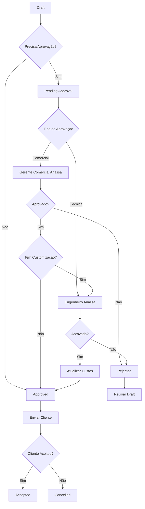

# Guia de Contribuição - OKEAN Yachts CPQ

Este documento consolida todas as práticas, padrões e convenções para desenvolvimento do sistema CPQ (Configure, Price, Quote) da OKEAN Yachts.

## Índice

1. [Visão Geral do Sistema](#1-visão-geral-do-sistema)
2. [Workflow de Desenvolvimento](#2-workflow-de-desenvolvimento)
3. [Arquitetura de Código](#3-arquitetura-de-código)
4. [Design System](#4-design-system)
5. [Validação & Formulários](#5-validação--formulários)
6. [Database & Supabase](#6-database--supabase)
7. [Regras de Negócio](#7-regras-de-negócio)
8. [Controle de Acesso (RBAC)](#8-controle-de-acesso-rbac)
9. [UI/UX Patterns](#9-uiux-patterns)
10. [SEO Guidelines](#10-seo-guidelines)
11. [Testes & Qualidade](#11-testes--qualidade)
12. [Segurança](#12-segurança)
13. [Deployment & Ambiente](#13-deployment--ambiente)
14. [Convenções de Commit](#14-convenções-de-commit)
15. [Troubleshooting Comum](#15-troubleshooting-comum)

---

## 1. Visão Geral do Sistema

### 1.1 Objetivo

Sistema CPQ para configuração e cotação de iates personalizados, incluindo:
- **Configurador visual** de modelos e opcionais
- **Sistema de cotações** com descontos granulares
- **Workflow de aprovações** multinível
- **Gestão de customizações** técnicas
- **Controle de acesso** baseado em roles (RBAC)

### 1.2 Stack Tecnológica

- **Frontend**: React 18, TypeScript, Vite, Tailwind CSS
- **UI Components**: shadcn/ui (Radix UI primitives)
- **Backend**: Supabase (PostgreSQL, Auth, Storage, Edge Functions)
- **Estado**: React Query (@tanstack/react-query)
- **Forms**: React Hook Form + Zod
- **Routing**: React Router v6

### 1.3 Domínios de Negócio

- **Configuração**: Modelos de iates, opcionais, categorias
- **Comercial**: Cotações, descontos, clientes
- **Aprovações**: Workflow de aprovação comercial e técnica
- **Customizações**: Solicitações técnicas, arquivos, prazos
- **Gestão**: Usuários, permissões, auditoria

---

## 2. Workflow de Desenvolvimento

### 2.1 Checklist Antes de Implementar

- [ ] **Verificar se funcionalidade já existe** - não reinventar a roda
- [ ] **Revisar arquivos no "useful-context"** - nunca ler arquivos já fornecidos
- [ ] **Planejar abordagem mínima mas correta** - não adicionar features não solicitadas
- [ ] **Confirmar escopo com usuário se ambíguo** - perguntar antes de assumir
- [ ] **Verificar impacto em regras de negócio** - especialmente aprovações e descontos

### 2.2 Ordem de Operações

1. **CHECK USEFUL-CONTEXT FIRST**
   - Nunca ler arquivos já fornecidos no contexto
   - Verificar se informações necessárias já estão disponíveis

2. **TOOL REVIEW**
   - Avaliar ferramentas disponíveis (logs, network, debugging)
   - Usar ferramentas de debugging ANTES de modificar código

3. **THINK & PLAN**
   - Reafirmar o que o usuário REALMENTE está pedindo
   - Definir o que muda e o que permanece intocado
   - Planejar abordagem mínima mas correta

4. **ASK CLARIFYING QUESTIONS**
   - Se escopo não estiver claro, perguntar ANTES de implementar
   - Aguardar resposta antes de chamar ferramentas

5. **GATHER CONTEXT EFFICIENTLY**
   - Agrupar operações de leitura quando possível
   - Ler apenas arquivos diretamente relevantes
   - Buscar informações na web quando necessário

6. **IMPLEMENT**
   - Focar nas mudanças explicitamente solicitadas
   - Preferir search-replace ao invés de reescrever arquivos
   - Criar componentes pequenos e focados

7. **VERIFY & CONCLUDE**
   - Garantir que todas as mudanças estão corretas
   - Testar com ferramentas disponíveis
   - Concluir com resumo conciso

### 2.3 Debugging First Approach

**✅ SEMPRE fazer antes de modificar código:**

```typescript
// 1. Console logs
console.log('Estado atual:', selectedOptions);
console.error('Erro ao salvar:', error);

// 2. Network requests
// Verificar payloads, status codes, headers

// 3. React Query DevTools
// Verificar cache, queries em flight, invalidações
```

**❌ NUNCA:**
- Adivinhar o problema sem confirmar com dados
- Modificar código antes de entender o erro
- Fazer múltiplas mudanças simultâneas sem testar

### 2.4 Batch Operations

**✅ EFICIENTE:**
```typescript
// Ler múltiplos arquivos de uma vez
await Promise.all([
  readFile('component.tsx'),
  readFile('hook.ts'),
  readFile('util.ts')
]);

// Escrever múltiplos arquivos em paralelo
await Promise.all([
  writeFile('NewComponent.tsx', content1),
  writeFile('newHook.ts', content2)
]);
```

**❌ INEFICIENTE:**
```typescript
// Sequencial - demora muito mais!
const file1 = await readFile('component.tsx');
const file2 = await readFile('hook.ts');
await writeFile('NewComponent.tsx', content1);
await writeFile('newHook.ts', content2);
```

---

## 3. Arquitetura de Código

### 3.1 Estrutura de Pastas

```
src/
├── components/
│   ├── ui/              # shadcn components (read-only)
│   ├── admin/           # Gestão de usuários, opções, modelos
│   ├── approvals/       # Aprovações comerciais e técnicas
│   ├── clients/         # CRUD de clientes
│   ├── configurator/    # Configurador de iates
│   └── [feature]/       # Outros componentes por domínio
├── hooks/
│   ├── useOptions.ts         # React Query hooks
│   ├── useConfigurationState.ts  # Estado local complexo
│   └── useUserRole.ts        # Auth & RBAC
├── lib/
│   ├── approval-utils.ts     # Lógica de aprovações
│   ├── quotation-utils.ts    # Cálculos e formatações
│   └── utils.ts              # Utilitários gerais (cn, etc)
├── pages/
│   ├── Admin.tsx
│   ├── Configurator.tsx
│   ├── Quotations.tsx
│   └── [feature].tsx
├── contexts/
│   └── AuthContext.tsx       # Auth state global
├── integrations/
│   └── supabase/
│       ├── client.ts         # Supabase client
│       └── types.ts          # Tipos auto-gerados (READ-ONLY)
└── index.css               # Design system tokens
```

### 3.2 Padrões de Nomenclatura

#### Arquivos e Componentes

```typescript
// ✅ PascalCase para componentes React
components/ConfigurationSummary.tsx
components/admin/CreateUserDialog.tsx

// ✅ camelCase para hooks
hooks/useConfigurationState.ts
hooks/useApprovals.ts

// ✅ kebab-case para utilitários
lib/approval-utils.ts
lib/quotation-utils.ts

// ✅ PascalCase para páginas (pois são componentes)
pages/Configurator.tsx
pages/QuotationDetail.tsx
```

#### Variáveis e Funções

```typescript
// ✅ camelCase para variáveis e funções
const selectedOptions = [...];
const handleSubmit = () => {};

// ✅ UPPER_SNAKE_CASE para constantes
const DISCOUNT_LIMITS = {
  noApprovalRequired: 2,
  managerApprovalRequired: 5
};

// ✅ PascalCase para tipos e interfaces
interface QuotationData {
  id: string;
  clientId: string;
}

type AppRole = 'administrador' | 'gerente_comercial' | 'vendedor';
```

### 3.3 Componentes React

#### 3.3.1 Early Returns para Readability

**✅ CORRETO:**
```typescript
export function QuotationCard({ quotation }: Props) {
  // 1. Early returns para casos especiais
  if (!quotation) {
    return <EmptyState message="Cotação não encontrada" />;
  }

  if (quotation.status === 'cancelled') {
    return <CancelledQuotationBanner />;
  }

  // 2. Lógica principal sem nesting excessivo
  const totalPrice = calculateTotalPrice(quotation);
  
  return (
    <Card>
      <CardHeader>
        <CardTitle>{quotation.quotation_number}</CardTitle>
      </CardHeader>
      <CardContent>
        <p>{formatCurrency(totalPrice)}</p>
      </CardContent>
    </Card>
  );
}
```

**❌ ERRADO:**
```typescript
export function QuotationCard({ quotation }: Props) {
  return (
    <>
      {quotation ? (
        quotation.status !== 'cancelled' ? (
          <Card>
            {/* Nesting excessivo dificulta leitura */}
          </Card>
        ) : (
          <CancelledQuotationBanner />
        )
      ) : (
        <EmptyState message="Cotação não encontrada" />
      )}
    </>
  );
}
```

#### 3.3.2 Estrutura de Componente Padrão

```typescript
// 1. Imports agrupados
import { useState } from "react";
import { useQuery } from "@tanstack/react-query";

// UI components
import { Button } from "@/components/ui/button";
import { Card } from "@/components/ui/card";

// Hooks e utils
import { useYachtModels } from "@/hooks/useYachtModels";
import { formatCurrency } from "@/lib/quotation-utils";

// 2. Tipos e interfaces
interface ConfiguratorProps {
  clientId: string;
  onSave: (data: QuotationData) => void;
}

// 3. Componente principal
export function Configurator({ clientId, onSave }: ConfiguratorProps) {
  // 3.1 React Query hooks
  const { data: models, isLoading } = useYachtModels();

  // 3.2 Estado local
  const [selectedModel, setSelectedModel] = useState<YachtModel | null>(null);

  // 3.3 Computações derivadas
  const totalPrice = useMemo(
    () => calculateTotal(selectedModel, selectedOptions),
    [selectedModel, selectedOptions]
  );

  // 3.4 Event handlers
  const handleModelSelect = (model: YachtModel) => {
    setSelectedModel(model);
  };

  // 3.5 Early returns
  if (isLoading) return <LoadingSpinner />;
  if (!models?.length) return <EmptyState />;

  // 3.6 Render principal
  return (
    <div className="space-y-6">
      {/* JSX */}
    </div>
  );
}
```

### 3.4 Hooks Customizados

#### 3.4.1 React Query Hooks (Data Fetching)

**✅ PADRÃO:**
```typescript
// hooks/useYachtModels.ts
import { useQuery } from "@tanstack/react-query";
import { supabase } from "@/integrations/supabase/client";

export function useYachtModels() {
  return useQuery({
    queryKey: ['yacht-models'],
    queryFn: async () => {
      const { data, error } = await supabase
        .from('yacht_models')
        .select('*')
        .eq('is_active', true)
        .order('name');
      
      if (error) throw error;
      return data;
    },
  });
}

// hooks/useCreateQuotation.ts
import { useMutation, useQueryClient } from "@tanstack/react-query";

export function useCreateQuotation() {
  const queryClient = useQueryClient();

  return useMutation({
    mutationFn: async (data: CreateQuotationData) => {
      const { data: quotation, error } = await supabase
        .from('quotations')
        .insert(data)
        .select()
        .single();
      
      if (error) throw error;
      return quotation;
    },
    onSuccess: () => {
      // Invalidar cache para refetch
      queryClient.invalidateQueries({ queryKey: ['quotations'] });
    },
  });
}
```

#### 3.4.2 Estado Local Complexo

**✅ PADRÃO:**
```typescript
// hooks/useConfigurationState.ts
export function useConfigurationState() {
  const [selectedModel, setSelectedModel] = useState<YachtModel | null>(null);
  const [selectedOptions, setSelectedOptions] = useState<SelectedOption[]>([]);

  const addOption = useCallback((option: Option, quantity: number) => {
    setSelectedOptions(prev => [
      ...prev.filter(o => o.id !== option.id),
      { ...option, quantity }
    ]);
  }, []);

  const removeOption = useCallback((optionId: string) => {
    setSelectedOptions(prev => prev.filter(o => o.id !== optionId));
  }, []);

  const totalPrice = useMemo(() => {
    if (!selectedModel) return 0;
    return calculateTotalPrice(selectedModel.base_price, selectedOptions);
  }, [selectedModel, selectedOptions]);

  return {
    selectedModel,
    setSelectedModel,
    selectedOptions,
    addOption,
    removeOption,
    totalPrice,
  };
}
```

### 3.5 Estado Local vs Global

#### Estado Local (useState, useReducer)
**Usar quando:**
- Estado específico a um componente ou feature isolada
- Não precisa ser compartilhado entre rotas
- Ex: formulários, modals, toggles locais

```typescript
// ✅ Estado local - apenas ConfigurationSummary precisa
function ConfigurationSummary() {
  const [isExpanded, setIsExpanded] = useState(false);
  return <Collapsible open={isExpanded}>...</Collapsible>;
}
```

#### Estado Global (Context)
**Usar quando:**
- Dados precisam ser compartilhados entre múltiplos componentes/rotas
- Autenticação, tema, preferências do usuário
- Ex: `AuthContext` para usuário logado

```typescript
// ✅ Estado global - usado em toda aplicação
export function AuthProvider({ children }: Props) {
  const [user, setUser] = useState<User | null>(null);
  return (
    <AuthContext.Provider value={{ user, setUser }}>
      {children}
    </AuthContext.Provider>
  );
}
```

#### Server State (React Query)
**SEMPRE usar para:**
- Dados do backend (Supabase)
- Cache automático, refetch, loading states
- Ex: cotações, opcionais, modelos

```typescript
// ✅ Server state - cache automático, refetch on focus
const { data: quotations } = useQuery({
  queryKey: ['quotations'],
  queryFn: fetchQuotations
});
```

---

## 4. Design System

### 4.1 Tokens Semânticos (HSL ONLY)

**⚠️ CRÍTICO: NUNCA usar cores diretas em componentes!**

#### index.css - Definir Tokens

```css
:root {
  /* Cores base - HSL format ONLY */
  --background: 0 0% 100%;
  --foreground: 222.2 84% 4.9%;

  --primary: 210 100% 50%;
  --primary-foreground: 210 40% 98%;

  --secondary: 210 40% 96.1%;
  --secondary-foreground: 222.2 47.4% 11.2%;

  --accent: 210 40% 96.1%;
  --accent-foreground: 222.2 47.4% 11.2%;

  /* Estados */
  --success: 142 76% 36%;
  --warning: 38 92% 50%;
  --destructive: 0 84% 60%;

  /* Bordas e inputs */
  --border: 214.3 31.8% 91.4%;
  --input: 214.3 31.8% 91.4%;
  --ring: 222.2 84% 4.9%;
}

.dark {
  --background: 222.2 84% 4.9%;
  --foreground: 210 40% 98%;
  
  --primary: 210 100% 50%;
  --primary-foreground: 222.2 47.4% 11.2%;
  
  /* ... outras cores para dark mode */
}
```

#### tailwind.config.ts - Mapear Tokens

```typescript
export default {
  theme: {
    extend: {
      colors: {
        background: "hsl(var(--background))",
        foreground: "hsl(var(--foreground))",
        primary: {
          DEFAULT: "hsl(var(--primary))",
          foreground: "hsl(var(--primary-foreground))",
        },
        secondary: {
          DEFAULT: "hsl(var(--secondary))",
          foreground: "hsl(var(--secondary-foreground))",
        },
        // ... resto dos tokens
      },
    },
  },
};
```

### 4.2 Variantes de Componentes

**✅ CORRETO - Criar variantes no design system:**

```typescript
// components/ui/button.tsx
const buttonVariants = cva(
  "inline-flex items-center justify-center transition-colors",
  {
    variants: {
      variant: {
        default: "bg-primary text-primary-foreground hover:bg-primary/90",
        secondary: "bg-secondary text-secondary-foreground hover:bg-secondary/80",
        destructive: "bg-destructive text-destructive-foreground hover:bg-destructive/90",
        outline: "border border-input bg-background hover:bg-accent hover:text-accent-foreground",
        ghost: "hover:bg-accent hover:text-accent-foreground",
        // ✅ Adicionar variantes customizadas
        success: "bg-success text-white hover:bg-success/90",
      },
      size: {
        default: "h-10 px-4 py-2",
        sm: "h-9 rounded-md px-3",
        lg: "h-11 rounded-md px-8",
        icon: "h-10 w-10",
      },
    },
    defaultVariants: {
      variant: "default",
      size: "default",
    },
  }
);

// Uso nos componentes
<Button variant="success">Aprovar</Button>
<Button variant="destructive">Rejeitar</Button>
```

### 4.3 ❌ O Que NUNCA Fazer

```typescript
// ❌ NUNCA: Classes de cor direta
<div className="bg-blue-600 text-white">...</div>
<Button className="bg-green-500 hover:bg-green-600">Salvar</Button>

// ❌ NUNCA: Overrides inline
<Button className="bg-primary text-white border-white hover:bg-white">
  Clique aqui
</Button>

// ❌ NUNCA: Estilos inline
<div style={{ backgroundColor: '#3b82f6', color: 'white' }}>...</div>
```

### 4.4 ✅ Como Fazer Correto

```typescript
// ✅ SEMPRE: Usar tokens semânticos
<div className="bg-background text-foreground">...</div>
<Card className="border-border">...</Card>

// ✅ SEMPRE: Criar variantes para casos especiais
// 1. Adicionar no design system (index.css)
:root {
  --success: 142 76% 36%;
  --success-foreground: 0 0% 100%;
}

// 2. Mapear no tailwind.config.ts
colors: {
  success: {
    DEFAULT: "hsl(var(--success))",
    foreground: "hsl(var(--success-foreground))",
  },
}

// 3. Criar variant no componente
const buttonVariants = cva({
  variants: {
    variant: {
      success: "bg-success text-success-foreground hover:bg-success/90",
    }
  }
});

// 4. Usar no componente
<Button variant="success">Aprovar Cotação</Button>
```

### 4.5 ⚠️ Dark Mode Pitfalls

```typescript
// ❌ Vai sumir no dark mode!
<h1 className="text-white">Título</h1>
<Card className="bg-white">...</Card>

// ✅ Usa tokens que se adaptam automaticamente
<h1 className="text-foreground">Título</h1>
<Card className="bg-card">...</Card>

// ❌ Contraste ruim em dark mode
<Button className="bg-gray-100 text-gray-900">Clique</Button>

// ✅ Contraste garantido pelo design system
<Button variant="secondary">Clique</Button>
```

### 4.6 Responsividade Mobile-First

```typescript
// ✅ Mobile-first - padrão é mobile, depois breakpoints maiores
<div className="grid grid-cols-1 md:grid-cols-2 lg:grid-cols-3">
  {/* 1 coluna mobile, 2 tablet, 3 desktop */}
</div>

<Button className="w-full md:w-auto">
  {/* Full-width mobile, auto desktop */}
  Salvar
</Button>

// ✅ Usar classes Tailwind responsivas
<h1 className="text-2xl md:text-4xl lg:text-5xl">
  {/* Font size responsivo */}
  OKEAN Yachts
</h1>

// ✅ Espaçamento responsivo
<div className="p-4 md:p-6 lg:p-8">
  {/* Padding aumenta com viewport */}
</div>
```

---

## 5. Validação & Formulários

### 5.1 Zod Schemas

**✅ SEMPRE validar com Zod:**

```typescript
// lib/schemas.ts
import { z } from "zod";

export const createQuotationSchema = z.object({
  client_id: z.string().uuid("Cliente inválido"),
  yacht_model_id: z.string().uuid("Modelo inválido"),
  
  base_discount_percentage: z
    .number()
    .min(0, "Desconto não pode ser negativo")
    .max(20, "Desconto máximo é 20%")
    .default(0),
  
  selected_options: z.array(
    z.object({
      option_id: z.string().uuid(),
      quantity: z.number().int().positive(),
      discount_percentage: z.number().min(0).max(15).default(0),
    })
  ),
  
  notes: z.string().max(1000, "Notas muito longas").optional(),
});

export type CreateQuotationInput = z.infer<typeof createQuotationSchema>;
```

### 5.2 React Hook Form Integration

```typescript
import { useForm } from "react-hook-form";
import { zodResolver } from "@hookform/resolvers/zod";
import { createQuotationSchema } from "@/lib/schemas";

export function CreateQuotationForm() {
  const form = useForm<CreateQuotationInput>({
    resolver: zodResolver(createQuotationSchema),
    defaultValues: {
      base_discount_percentage: 0,
      selected_options: [],
    },
  });

  const onSubmit = async (data: CreateQuotationInput) => {
    try {
      // Validação já ocorreu automaticamente
      await createQuotation(data);
      toast.success("Cotação criada com sucesso!");
    } catch (error) {
      toast.error("Erro ao criar cotação");
    }
  };

  return (
    <Form {...form}>
      <form onSubmit={form.handleSubmit(onSubmit)}>
        <FormField
          control={form.control}
          name="base_discount_percentage"
          render={({ field }) => (
            <FormItem>
              <FormLabel>Desconto Base (%)</FormLabel>
              <FormControl>
                <Input type="number" {...field} />
              </FormControl>
              <FormMessage />
            </FormItem>
          )}
        />
        
        <Button type="submit" disabled={form.formState.isSubmitting}>
          Salvar Cotação
        </Button>
      </form>
    </Form>
  );
}
```

### 5.3 Validação Frontend + Backend

**⚠️ NUNCA confiar apenas em validação frontend!**

```typescript
// ✅ Frontend: Validação Zod
const schema = z.object({
  discount: z.number().max(10)
});

// ✅ Backend: Edge Function também valida
// supabase/functions/create-quotation/index.ts
const payload = createQuotationSchema.parse(await req.json());

// ✅ Database: Constraints adicionais
ALTER TABLE quotations ADD CONSTRAINT check_discount 
CHECK (base_discount_percentage >= 0 AND base_discount_percentage <= 20);
```

---

## 6. Database & Supabase

### 6.1 Estrutura de Tabelas Principais

#### quotations
```sql
CREATE TABLE quotations (
  id uuid PRIMARY KEY DEFAULT gen_random_uuid(),
  quotation_number text UNIQUE NOT NULL,
  client_id uuid REFERENCES clients(id) NOT NULL,
  yacht_model_id uuid REFERENCES yacht_models(id) NOT NULL,
  
  -- Preços e descontos
  base_price numeric NOT NULL,
  base_discount_percentage numeric DEFAULT 0 CHECK (base_discount_percentage >= 0),
  final_base_price numeric NOT NULL,
  
  options_total numeric DEFAULT 0,
  options_discount_percentage numeric DEFAULT 0,
  final_options_total numeric DEFAULT 0,
  
  total_price numeric NOT NULL,
  
  -- Status e workflow
  status quotation_status DEFAULT 'draft',
  
  -- Aprovações
  requires_approval boolean DEFAULT false,
  commercial_approval_status approval_status,
  engineering_approval_status approval_status,
  
  -- Metadados
  created_by uuid REFERENCES auth.users(id),
  created_at timestamptz DEFAULT now(),
  updated_at timestamptz DEFAULT now()
);
```

#### quotation_options
```sql
CREATE TABLE quotation_options (
  id uuid PRIMARY KEY DEFAULT gen_random_uuid(),
  quotation_id uuid REFERENCES quotations(id) ON DELETE CASCADE NOT NULL,
  option_id uuid REFERENCES options(id) NOT NULL,
  
  quantity integer NOT NULL CHECK (quantity > 0),
  unit_price numeric NOT NULL,
  discount_percentage numeric DEFAULT 0 CHECK (discount_percentage >= 0),
  final_unit_price numeric NOT NULL,
  total_price numeric NOT NULL,
  
  created_at timestamptz DEFAULT now()
);
```

#### approval_requests
```sql
CREATE TABLE approval_requests (
  id uuid PRIMARY KEY DEFAULT gen_random_uuid(),
  quotation_id uuid REFERENCES quotations(id) ON DELETE CASCADE NOT NULL,
  type approval_type NOT NULL, -- 'commercial', 'engineering'
  
  status approval_status DEFAULT 'pending',
  discount_percentage numeric,
  
  requested_by uuid REFERENCES auth.users(id),
  approved_by uuid REFERENCES auth.users(id),
  
  notes text,
  created_at timestamptz DEFAULT now(),
  resolved_at timestamptz
);
```

### 6.2 Enums Importantes

```sql
CREATE TYPE quotation_status AS ENUM (
  'draft',
  'pending_approval',
  'approved',
  'rejected',
  'sent',
  'accepted',
  'cancelled'
);

CREATE TYPE approval_type AS ENUM (
  'commercial',
  'engineering'
);

CREATE TYPE approval_status AS ENUM (
  'pending',
  'approved',
  'rejected'
);

CREATE TYPE app_role AS ENUM (
  'administrador',
  'gerente_comercial',
  'vendedor',
  'engenheiro'
);
```

### 6.3 Row Level Security (RLS)

**⚠️ TODA tabela DEVE ter RLS habilitado!**

```sql
-- 1. Habilitar RLS
ALTER TABLE quotations ENABLE ROW LEVEL SECURITY;

-- 2. Criar policies usando has_role() SECURITY DEFINER
CREATE POLICY "Admins e gerentes podem ver todas as cotações"
  ON quotations FOR SELECT
  USING (
    has_role(auth.uid(), 'administrador') OR
    has_role(auth.uid(), 'gerente_comercial')
  );

CREATE POLICY "Vendedores podem ver apenas suas cotações"
  ON quotations FOR SELECT
  USING (
    has_role(auth.uid(), 'vendedor') AND 
    created_by = auth.uid()
  );

CREATE POLICY "Apenas admins podem deletar cotações"
  ON quotations FOR DELETE
  USING (has_role(auth.uid(), 'administrador'));
```

### 6.4 Migrations Pattern

**⚠️ NUNCA editar migrations existentes!**

```sql
-- ✅ Criar nova migration para mudanças
-- supabase/migrations/20250116000000_add_discount_limits.sql

-- Adicionar coluna
ALTER TABLE quotations ADD COLUMN max_discount_percentage numeric DEFAULT 20;

-- Adicionar constraint
ALTER TABLE quotations ADD CONSTRAINT check_max_discount
CHECK (base_discount_percentage <= max_discount_percentage);

-- Criar index para performance
CREATE INDEX idx_quotations_status ON quotations(status);
CREATE INDEX idx_quotations_client ON quotations(client_id);

-- Atualizar RLS policies
DROP POLICY IF EXISTS "Vendedores podem criar cotações" ON quotations;
CREATE POLICY "Vendedores podem criar cotações"
  ON quotations FOR INSERT
  WITH CHECK (
    has_role(auth.uid(), 'vendedor') AND
    created_by = auth.uid()
  );
```

### 6.5 Storage & Buckets

```sql
-- Criar bucket para arquivos de customizações
INSERT INTO storage.buckets (id, name, public) 
VALUES ('customization-files', 'customization-files', false);

-- Policies para acesso controlado
CREATE POLICY "Usuários autorizados podem visualizar arquivos"
  ON storage.objects FOR SELECT
  USING (
    bucket_id = 'customization-files' AND
    (
      has_role(auth.uid(), 'administrador') OR
      has_role(auth.uid(), 'gerente_comercial') OR
      has_role(auth.uid(), 'engenheiro')
    )
  );

CREATE POLICY "Engenheiros podem fazer upload"
  ON storage.objects FOR INSERT
  WITH CHECK (
    bucket_id = 'customization-files' AND
    has_role(auth.uid(), 'engenheiro')
  );
```

---

## 7. Regras de Negócio

### 7.1 Sistema de Descontos Granulares

#### Limites de Desconto (Base)
```typescript
// lib/approval-utils.ts
export const BASE_DISCOUNT_LIMITS = {
  noApprovalRequired: 10,     // até 10% não precisa aprovação
  managerApprovalRequired: 15, // 10-15% precisa gerente comercial
  adminApprovalRequired: Infinity // > 15% precisa admin
};
```

#### Limites de Desconto (Opcionais)
```typescript
export const OPTIONS_DISCOUNT_LIMITS = {
  noApprovalRequired: 8,      // até 8% não precisa aprovação
  managerApprovalRequired: 12, // 8-12% precisa gerente comercial
  adminApprovalRequired: Infinity // > 12% precisa admin
};
```

#### Lógica de Aprovação

```typescript
export function getRequiredApproverRole(
  baseDiscount: number,
  optionsDiscount: number
): AppRole | null {
  const maxDiscount = Math.max(baseDiscount, optionsDiscount);
  
  if (maxDiscount <= 10) {
    return null; // Não precisa aprovação
  }
  
  if (maxDiscount <= 15) {
    return 'gerente_comercial';
  }
  
  return 'administrador';
}

export function needsApproval(
  baseDiscount: number,
  optionsDiscount: number
): boolean {
  return Math.max(baseDiscount, optionsDiscount) > 10;
}
```

### 7.2 Sistema de Customizações

#### Tipos de Customização
```typescript
export enum CustomizationType {
  LAYOUT_CHANGE = 'layout_change',       // Mudança de layout interno
  STRUCTURAL = 'structural',             // Mudança estrutural
  ELECTRICAL = 'electrical',             // Sistema elétrico
  PLUMBING = 'plumbing',                // Hidráulica
  AESTHETIC = 'aesthetic',              // Mudança estética
  OTHER = 'other'
}
```

#### Workflow de Aprovação Técnica
```typescript
// 1. Cliente solicita customização
const customization = {
  quotation_id: quotationId,
  type: CustomizationType.STRUCTURAL,
  description: "Adicionar terceiro camarote",
  files: [/* arquivos anexos */]
};

// 2. Engenheiro analisa e responde
const response = {
  status: 'approved', // ou 'rejected'
  estimated_cost: 50000,
  delivery_days_impact: 30,
  engineering_notes: "Viável, requer reforço estrutural"
};

// 3. Atualizar cotação com custos adicionais
if (response.status === 'approved') {
  quotation.customization_cost = response.estimated_cost;
  quotation.delivery_days += response.delivery_days_impact;
  quotation.total_price += response.estimated_cost;
}
```

### 7.3 Status de Cotações

#### Máquina de Estados

```typescript
type QuotationStatus =
  | 'draft'              // Rascunho - ainda sendo editada
  | 'pending_approval'   // Aguardando aprovação comercial/técnica
  | 'approved'           // Aprovada - pronta para enviar ao cliente
  | 'rejected'           // Rejeitada
  | 'sent'               // Enviada ao cliente
  | 'accepted'           // Cliente aceitou
  | 'cancelled';         // Cancelada

// Transições válidas
const VALID_TRANSITIONS: Record<QuotationStatus, QuotationStatus[]> = {
  draft: ['pending_approval', 'cancelled'],
  pending_approval: ['approved', 'rejected', 'draft'],
  approved: ['sent', 'cancelled'],
  rejected: ['draft', 'cancelled'],
  sent: ['accepted', 'cancelled'],
  accepted: [],
  cancelled: []
};
```

#### Regras de Transição

```typescript
export function canTransitionTo(
  currentStatus: QuotationStatus,
  nextStatus: QuotationStatus,
  userRoles: AppRole[]
): boolean {
  // Verificar se transição é válida
  if (!VALID_TRANSITIONS[currentStatus].includes(nextStatus)) {
    return false;
  }
  
  // Regras específicas por role
  if (nextStatus === 'approved') {
    // Apenas gerente ou admin podem aprovar
    return userRoles.some(r => 
      r === 'gerente_comercial' || r === 'administrador'
    );
  }
  
  if (nextStatus === 'cancelled') {
    // Apenas admin pode cancelar cotações enviadas
    if (currentStatus === 'sent') {
      return userRoles.includes('administrador');
    }
  }
  
  return true;
}
```

### 7.4 Workflow de Aprovações Completo


```mermaid
graph TD
    A[Draft] --> B{Precisa Aprovação?}
    B -->|Sim| C[Pending Approval]
    B -->|Não| D[Approved]
    
    C --> E{Tipo de Aprovação}
    E -->|Comercial| F[Gerente Comercial Analisa]
    E -->|Técnica| G[Engenheiro Analisa]
    
    F --> H{Aprovado?}
    G --> I{Aprovado?}
    
    H -->|Sim| J{Tem Customização?}
    H -->|Não| K[Rejected]
    
    I -->|Sim| L[Atualizar Custos]
    I -->|Não| K
    
    J -->|Sim| G
    J -->|Não| D
    
    L --> D
    K --> M[Revisar Draft]
    
    D --> N[Enviar Cliente]
    N --> O{Cliente Aceitou?}
    O -->|Sim| P[Accepted]
    O -->|Não| Q[Cancelled]
```

---

## 8. Controle de Acesso (RBAC)

### 8.1 Roles & Permissões

```typescript
// hooks/useUserRole.ts
export type AppRole = 
  | 'administrador'
  | 'gerente_comercial'
  | 'vendedor'
  | 'engenheiro';

export const ROLE_PERMISSIONS = {
  administrador: [
    'quotations:create',
    'quotations:read',
    'quotations:update',
    'quotations:delete',
    'quotations:approve',
    'users:manage',
    'options:manage',
    'models:manage'
  ],
  gerente_comercial: [
    'quotations:create',
    'quotations:read',
    'quotations:update',
    'quotations:approve',
    'approvals:manage'
  ],
  vendedor: [
    'quotations:create',
    'quotations:read',
    'quotations:update'
  ],
  engenheiro: [
    'quotations:read',
    'customizations:manage',
    'engineering:approve'
  ]
};
```

### 8.2 ⚠️ CRÍTICO: Roles em Tabela Separada

**❌ NUNCA fazer:**
```sql
-- VULNERÁVEL A PRIVILEGE ESCALATION!
ALTER TABLE users ADD COLUMN role text;

-- Usuário pode editar seu próprio role via UPDATE
UPDATE users SET role = 'administrador' WHERE id = auth.uid();
```

**✅ SEMPRE fazer:**
```sql
-- 1. Tabela separada com RLS rigoroso
CREATE TABLE user_roles (
  id uuid PRIMARY KEY DEFAULT gen_random_uuid(),
  user_id uuid REFERENCES auth.users(id) ON DELETE CASCADE NOT NULL,
  role app_role NOT NULL,
  UNIQUE (user_id, role)
);

-- 2. RLS: apenas admins podem modificar
ALTER TABLE user_roles ENABLE ROW LEVEL SECURITY;

CREATE POLICY "Admins can manage roles"
  ON user_roles FOR ALL
  USING (has_role(auth.uid(), 'administrador'));

CREATE POLICY "Users can view their own roles"
  ON user_roles FOR SELECT
  USING (user_id = auth.uid());

-- 3. Função SECURITY DEFINER (bypassa RLS)
CREATE OR REPLACE FUNCTION has_role(_user_id uuid, _role app_role)
RETURNS boolean
LANGUAGE sql
STABLE SECURITY DEFINER
SET search_path = public
AS $$
  SELECT EXISTS (
    SELECT 1 FROM user_roles
    WHERE user_id = _user_id AND role = _role
  )
$$;
```

### 8.3 ⚠️ NUNCA Validar Admin via Client-Side

**❌ VULNERÁVEL:**
```typescript
// Pode ser manipulado pelo usuário via DevTools!
const isAdmin = localStorage.getItem('isAdmin') === 'true';
const userRole = sessionStorage.getItem('role');

if (isAdmin) {
  // Mostrar funcionalidades de admin
}
```

**✅ SEGURO:**
```typescript
// 1. Backend sempre valida via has_role()
// supabase/functions/delete-quotation/index.ts
const { data: isAdmin } = await supabase
  .rpc('has_role', { 
    _user_id: user.id, 
    _role: 'administrador' 
  });

if (!isAdmin) {
  return new Response('Forbidden', { status: 403 });
}

// 2. Frontend apenas para UX (não para segurança)
export function useUserRole() {
  return useQuery({
    queryKey: ['user-roles'],
    queryFn: async () => {
      const { data } = await supabase
        .from('user_roles')
        .select('role')
        .eq('user_id', user.id);
      
      return data?.map(r => r.role) || [];
    }
  });
}

// 3. Uso no componente (apenas UI)
const { data: roles } = useUserRole();
const isAdmin = roles?.includes('administrador');

// ✅ OK: Esconder botão (UX)
{isAdmin && <Button onClick={deleteUser}>Deletar</Button>}

// ⚠️ Mas backend SEMPRE valida novamente!
```

### 8.4 RLS Policies Exemplos

```sql
-- Quotations: Admins e Gerentes veem tudo, Vendedores veem só suas
CREATE POLICY "Users can view quotations based on role"
  ON quotations FOR SELECT
  USING (
    has_role(auth.uid(), 'administrador') OR
    has_role(auth.uid(), 'gerente_comercial') OR
    (has_role(auth.uid(), 'vendedor') AND created_by = auth.uid())
  );

-- Approval Requests: Apenas quem pode aprovar consegue ver
CREATE POLICY "Users can view approval requests if authorized"
  ON approval_requests FOR SELECT
  USING (
    CASE 
      WHEN type = 'commercial' THEN
        has_role(auth.uid(), 'administrador') OR
        has_role(auth.uid(), 'gerente_comercial')
      WHEN type = 'engineering' THEN
        has_role(auth.uid(), 'administrador') OR
        has_role(auth.uid(), 'engenheiro')
      ELSE false
    END
  );

-- Customizations: Engenheiros e gerentes podem gerenciar
CREATE POLICY "Engineers can manage customizations"
  ON customizations FOR ALL
  USING (
    has_role(auth.uid(), 'administrador') OR
    has_role(auth.uid(), 'engenheiro') OR
    has_role(auth.uid(), 'gerente_comercial')
  );
```

### 8.5 ProtectedRoute Component

```typescript
// components/ProtectedRoute.tsx
import { Navigate } from "react-router-dom";
import { useAuth } from "@/contexts/AuthContext";
import { useUserRole } from "@/hooks/useUserRole";

interface ProtectedRouteProps {
  children: React.ReactNode;
  requiredRoles?: AppRole[];
}

export function ProtectedRoute({ children, requiredRoles }: ProtectedRouteProps) {
  const { user, loading } = useAuth();
  const { data: roles, isLoading: rolesLoading } = useUserRole();

  if (loading || rolesLoading) {
    return <LoadingSpinner />;
  }

  if (!user) {
    return <Navigate to="/auth" replace />;
  }

  if (requiredRoles && !requiredRoles.some(r => roles?.includes(r))) {
    return <Navigate to="/" replace />;
  }

  return <>{children}</>;
}

// Uso nas rotas
<Route
  path="/admin"
  element={
    <ProtectedRoute requiredRoles={['administrador']}>
      <AdminPage />
    </ProtectedRoute>
  }
/>
```

---

## 9. UI/UX Patterns

### 9.1 Loading States

```typescript
// ✅ Skeleton para listas
import { Skeleton } from "@/components/ui/skeleton";

function QuotationsList() {
  const { data: quotations, isLoading } = useQuotations();

  if (isLoading) {
    return (
      <div className="space-y-4">
        {Array.from({ length: 5 }).map((_, i) => (
          <Skeleton key={i} className="h-24 w-full" />
        ))}
      </div>
    );
  }

  return <>{/* Lista de cotações */}</>;
}

// ✅ Spinner para ações
import { Loader2 } from "lucide-react";

function SaveButton() {
  const { mutate: saveQuotation, isPending } = useSaveQuotation();

  return (
    <Button onClick={saveQuotation} disabled={isPending}>
      {isPending && <Loader2 className="mr-2 h-4 w-4 animate-spin" />}
      Salvar Cotação
    </Button>
  );
}
```

### 9.2 Error States

```typescript
// ✅ Error boundary para erros inesperados
import { Alert, AlertDescription, AlertTitle } from "@/components/ui/alert";
import { AlertCircle } from "lucide-react";

function QuotationsList() {
  const { data, isLoading, error } = useQuotations();

  if (error) {
    return (
      <Alert variant="destructive">
        <AlertCircle className="h-4 w-4" />
        <AlertTitle>Erro ao carregar cotações</AlertTitle>
        <AlertDescription>
          {error.message || "Ocorreu um erro inesperado."}
        </AlertDescription>
      </Alert>
    );
  }

  // ... resto do componente
}
```

### 9.3 Empty States

```typescript
// ✅ Empty state informativo
import { FileText } from "lucide-react";

function QuotationsList() {
  const { data: quotations } = useQuotations();

  if (!quotations?.length) {
    return (
      <div className="flex flex-col items-center justify-center py-12">
        <FileText className="h-12 w-12 text-muted-foreground mb-4" />
        <h3 className="text-lg font-semibold mb-2">
          Nenhuma cotação encontrada
        </h3>
        <p className="text-muted-foreground mb-4">
          Crie sua primeira cotação para começar.
        </p>
        <Button onClick={() => navigate('/configurator')}>
          Nova Cotação
        </Button>
      </div>
    );
  }

  // ... lista de cotações
}
```

### 9.4 Confirmações (Ações Destrutivas)

```typescript
// ✅ AlertDialog para confirmações
import {
  AlertDialog,
  AlertDialogAction,
  AlertDialogCancel,
  AlertDialogContent,
  AlertDialogDescription,
  AlertDialogFooter,
  AlertDialogHeader,
  AlertDialogTitle,
} from "@/components/ui/alert-dialog";

function DeleteQuotationButton({ quotationId }: Props) {
  const [open, setOpen] = useState(false);
  const { mutate: deleteQuotation } = useDeleteQuotation();

  return (
    <>
      <Button variant="destructive" onClick={() => setOpen(true)}>
        Deletar
      </Button>

      <AlertDialog open={open} onOpenChange={setOpen}>
        <AlertDialogContent>
          <AlertDialogHeader>
            <AlertDialogTitle>Confirmar exclusão</AlertDialogTitle>
            <AlertDialogDescription>
              Esta ação não pode ser desfeita. A cotação será permanentemente deletada.
            </AlertDialogDescription>
          </AlertDialogHeader>
          <AlertDialogFooter>
            <AlertDialogCancel>Cancelar</AlertDialogCancel>
            <AlertDialogAction
              onClick={() => {
                deleteQuotation(quotationId);
                setOpen(false);
              }}
            >
              Deletar
            </AlertDialogAction>
          </AlertDialogFooter>
        </AlertDialogContent>
      </AlertDialog>
    </>
  );
}
```

### 9.5 Toast Notifications

```typescript
import { toast } from "sonner";

// ✅ Sucesso
toast.success("Cotação salva com sucesso!");

// ✅ Erro
toast.error("Erro ao salvar cotação", {
  description: error.message
});

// ✅ Informação
toast.info("Esta cotação requer aprovação do gerente comercial");

// ✅ Promise (loading -> success/error automático)
toast.promise(saveQuotation(data), {
  loading: "Salvando cotação...",
  success: "Cotação salva com sucesso!",
  error: "Erro ao salvar cotação"
});
```

### 9.6 Tailwind Best Practices

```typescript
// ✅ Usar utilitário cn() para classes condicionais
import { cn } from "@/lib/utils";

<Card className={cn(
  "p-6",
  isActive && "border-primary",
  isError && "border-destructive"
)} />

// ✅ Agrupar classes relacionadas
<div className={cn(
  // Layout
  "flex items-center justify-between",
  // Spacing
  "p-4 gap-4",
  // Colors
  "bg-card text-card-foreground",
  // Borders
  "border rounded-lg"
)} />

// ❌ Não misturar classes conflitantes
<div className="p-4 p-6" /> // ❌ Conflito
<div className="p-6" />     // ✅ Correto
```

### 9.7 Navegação Global (AppHeader)

O sistema utiliza um **header global consistente** em todas as páginas principais (não-admin) para garantir navegação clara de volta ao home.

#### 9.7.1 Componente AppHeader

**Localização:** `src/components/AppHeader.tsx`

**Características:**
- ✅ Logo OKEAN Yachts **clicável** que navega para `/`
- ✅ Botão "Início" adicional (opcional, hidden em mobile)
- ✅ Título da página (breadcrumb simples)
- ✅ UserMenu no canto direito
- ✅ Sticky header com backdrop blur para contexto visual

**Uso Padrão:**

```typescript
import { AppHeader } from "@/components/AppHeader";

export default function MyPage() {
  return (
    <>
      <AppHeader title="Título da Página" />
      <div className="container mx-auto p-6">
        {/* Conteúdo da página */}
      </div>
    </>
  );
}
```

**Props:**

| Prop | Tipo | Default | Descrição |
|------|------|---------|-----------|
| `title` | `string \| undefined` | - | Título da página (breadcrumb) |
| `showHomeButton` | `boolean` | `true` | Exibir botão "Início" adicional |

**Exemplos de Uso:**

```typescript
// ✅ Página com título simples
<AppHeader title="Cotações" />

// ✅ Página com título dinâmico
<AppHeader title={`Cotação ${quotation.quotation_number}`} />

// ✅ Sem botão home adicional (logo ainda é clicável)
<AppHeader title="Clientes" showHomeButton={false} />

// ✅ Apenas logo e UserMenu (sem breadcrumb)
<AppHeader />
```

#### 9.7.2 Páginas que Usam AppHeader

**✅ Implementado em:**
- `src/pages/Quotations.tsx`
- `src/pages/Clients.tsx`
- `src/pages/QuotationDetail.tsx`

**❌ Não usado (tem navegação própria):**
- `src/pages/Index.tsx` - Home (não precisa)
- `src/pages/Configurator.tsx` - Tem layout específico
- `src/pages/Auth.tsx` - Página de login

#### 9.7.3 AdminLayout vs AppHeader

**AdminLayout** (páginas `/admin/*`):
- Usado para páginas administrativas
- Sidebar com navegação vertical
- Link "🏠 Voltar ao Início" destacado no topo da sidebar
- UserMenu integrado ao layout

**AppHeader** (páginas regulares):
- Usado para páginas operacionais (cotações, clientes, etc)
- Header horizontal fixo no topo
- Logo clicável + botão "Início"
- UserMenu no canto direito

**Quando usar cada um:**

```typescript
// ✅ AdminLayout para páginas /admin/*
export default function AdminYachtModels() {
  return (
    <AdminLayout>
      {/* Conteúdo administrativo */}
    </AdminLayout>
  );
}

// ✅ AppHeader para páginas operacionais
export default function Quotations() {
  return (
    <>
      <AppHeader title="Cotações" />
      <div className="container mx-auto p-6">
        {/* Conteúdo operacional */}
      </div>
    </>
  );
}
```

#### 9.7.4 Navegação Hierárquica (Breadcrumbs Complexos)

Para páginas com **navegação hierárquica** (ex: Cotação → Detalhe), combine `AppHeader` com botão "Voltar":

```typescript
export default function QuotationDetail() {
  const navigate = useNavigate();
  const { quotation } = useQuotationData();

  return (
    <>
      <AppHeader title={`Cotação ${quotation.quotation_number}`} />
      <div className="container mx-auto p-6 space-y-6">
        {/* Botão voltar para lista */}
        <Button
          variant="ghost"
          onClick={() => navigate("/quotations")}
        >
          <ArrowLeft className="mr-2 h-4 w-4" />
          Voltar para Cotações
        </Button>

        {/* Conteúdo do detalhe */}
      </div>
    </>
  );
}
```

#### 9.7.5 Responsividade Mobile

O `AppHeader` é **mobile-first**:

```typescript
// Logo sempre visível
<h1 className="text-2xl font-bold">OKEAN Yachts</h1>

// Botão "Início" oculto em mobile
<Button className="hidden md:flex">
  <Home className="h-4 w-4 mr-2" />
  Início
</Button>

// Título oculto em telas pequenas (opcional)
{title && (
  <span className="font-medium hidden sm:inline">{title}</span>
)}
```

#### 9.7.6 Checklist ao Criar Nova Página

**Ao criar uma nova página, decidir:**

- [ ] É página administrativa? → Usar `AdminLayout`
- [ ] É página operacional? → Usar `AppHeader`
- [ ] É a home ou login? → Não usar nenhum (layout próprio)
- [ ] Precisa de breadcrumb? → Passar `title` prop
- [ ] Precisa de botão "Voltar"? → Adicionar `Button` com `ArrowLeft`

**Exemplo de checklist preenchido:**

✅ **Nova página: "Aprovações Pendentes"**
- ✅ É operacional (não admin)
- ✅ Usar `AppHeader title="Aprovações Pendentes"`
- ✅ Não precisa de botão voltar (acesso direto do menu)

#### 9.7.7 Convenção de Commit

Ao modificar navegação:

```bash
# Adicionar AppHeader em nova página
feat(navigation): adicionar AppHeader na página de relatórios

# Corrigir navegação
fix(navigation): corrigir título do breadcrumb em QuotationDetail

# Melhorar UX de navegação
refactor(navigation): melhorar responsividade do AppHeader
```

---

## 10. SEO Guidelines

### 10.1 Meta Tags (Obrigatório)

```typescript
// ✅ Usar React Helmet ou similar
import { Helmet } from "react-helmet-async";

function ConfiguratorPage() {
  return (
    <>
      <Helmet>
        <title>Configurador de Iates - OKEAN Yachts</title>
        <meta
          name="description"
          content="Configure seu iate personalizado com opcionais exclusivos. Sistema CPQ para cotações de iates de luxo."
        />
        <meta property="og:title" content="Configurador de Iates - OKEAN Yachts" />
        <meta property="og:description" content="Configure seu iate personalizado" />
        <meta property="og:type" content="website" />
        <link rel="canonical" href="https://okean.com/configurator" />
      </Helmet>
      
      {/* Conteúdo da página */}
    </>
  );
}
```

### 10.2 Semantic HTML

```typescript
// ✅ SEMPRE usar tags semânticas
function QuotationPage() {
  return (
    <main className="container mx-auto">
      <header className="mb-8">
        <h1 className="text-3xl font-bold">Cotação #{number}</h1>
      </header>

      <article className="space-y-6">
        <section aria-labelledby="client-info">
          <h2 id="client-info">Informações do Cliente</h2>
          {/* Conteúdo */}
        </section>

        <section aria-labelledby="configuration">
          <h2 id="configuration">Configuração</h2>
          {/* Conteúdo */}
        </section>
      </article>

      <footer className="mt-8">
        <p className="text-muted-foreground">
          Criado em {formatDate(createdAt)}
        </p>
      </footer>
    </main>
  );
}

// ❌ NUNCA usar divs para tudo
<div className="page">
  <div className="header">
    <div className="title">Cotação</div>
  </div>
</div>
```

### 10.3 Structured Data (JSON-LD)

```typescript
// ✅ Adicionar JSON-LD para produtos/cotações
function QuotationDetailPage({ quotation }: Props) {
  const structuredData = {
    "@context": "https://schema.org",
    "@type": "Product",
    "name": quotation.yacht_model.name,
    "description": quotation.yacht_model.description,
    "offers": {
      "@type": "Offer",
      "price": quotation.total_price,
      "priceCurrency": "BRL",
      "availability": "https://schema.org/InStock"
    },
    "brand": {
      "@type": "Brand",
      "name": "OKEAN Yachts"
    }
  };

  return (
    <>
      <Helmet>
        <script type="application/ld+json">
          {JSON.stringify(structuredData)}
        </script>
      </Helmet>
      
      {/* Conteúdo da página */}
    </>
  );
}
```

### 10.4 Image Optimization

```typescript
// ✅ SEMPRE adicionar atributo alt descritivo


// ✅ Usar srcset para responsividade

```

### 10.5 Performance

```typescript
// ✅ Lazy loading de componentes pesados
import { lazy, Suspense } from "react";

const HeavyChart = lazy(() => import("@/components/HeavyChart"));

function DashboardPage() {
  return (
    <Suspense fallback={<Skeleton className="h-96" />}>
      <HeavyChart data={data} />
    </Suspense>
  );
}

// ✅ Defer scripts não-críticos
<Helmet>
  <script defer src="https://analytics.example.com/script.js" />
</Helmet>

// ✅ Preload recursos críticos
<Helmet>
  <link rel="preload" href="/fonts/inter.woff2" as="font" type="font/woff2" crossOrigin="anonymous" />
</Helmet>
```

---

## 11. Testes & Qualidade

### 11.1 Checklist de PR/Code Review

**Antes de criar PR:**
- [ ] Código segue padrões de nomenclatura
- [ ] Componentes usam design system (não cores diretas)
- [ ] Formulários têm validação Zod
- [ ] RLS policies estão corretas
- [ ] Não há console.logs esquecidos
- [ ] Imports estão organizados
- [ ] Early returns para legibilidade
- [ ] Loading e error states implementados
- [ ] Toast notifications para feedback
- [ ] Commit messages seguem convenção

**Durante Code Review:**
- [ ] Lógica de negócio está correta
- [ ] Não há vulnerabilidades de segurança
- [ ] Performance está adequada
- [ ] Código está bem documentado
- [ ] Testes relevantes foram adicionados (se aplicável)

### 11.2 Debugging Workflow

```typescript
// 1. Identificar problema
// Usar console logs, React Query DevTools, Network tab

// 2. Isolar causa raiz
console.log('Estado antes:', state);
try {
  await problematicFunction();
} catch (error) {
  console.error('Erro:', error);
  console.log('Estado depois:', state);
}

// 3. Criar reprodução mínima
// Isolar em componente separado se necessário

// 4. Implementar fix
// Testar localmente

// 5. Adicionar safeguards
if (!data) {
  console.warn('Data is missing');
  return null;
}

// 6. Remover logs de debug antes de commit
// ❌ Não commitar console.logs temporários
```

### 11.3 Tools para Debugging

```typescript
// React Query DevTools (adicionar em App.tsx)
import { ReactQueryDevtools } from '@tanstack/react-query-devtools';

function App() {
  return (
    <>
      {/* App content */}
      <ReactQueryDevtools initialIsOpen={false} />
    </>
  );
}

// Supabase logs
supabase.auth.onAuthStateChange((event, session) => {
  console.log('Auth event:', event);
  console.log('Session:', session);
});
```

---

## 12. Segurança

### 12.1 ⚠️ CRÍTICO: Roles em Tabela Separada

**Ver seção 8.2 para detalhes completos.**

**Resumo:**
- ❌ NUNCA armazenar roles em `users` ou `profiles` table
- ✅ SEMPRE usar tabela `user_roles` separada
- ✅ SEMPRE usar função `has_role()` SECURITY DEFINER
- ✅ SEMPRE validar no backend, nunca confiar em client-side

### 12.2 ⚠️ Input Validation

```typescript
// ✅ SEMPRE validar com Zod no frontend
const schema = z.object({
  email: z.string().email().max(255),
  discount: z.number().min(0).max(20)
});

// ✅ SEMPRE validar no backend também
// supabase/functions/*/index.ts
try {
  const payload = schema.parse(await req.json());
} catch (error) {
  return new Response('Invalid input', { status: 400 });
}

// ✅ Database constraints como última linha de defesa
ALTER TABLE quotations ADD CONSTRAINT check_discount
CHECK (base_discount_percentage >= 0 AND base_discount_percentage <= 20);
```

### 12.3 ⚠️ SQL Injection Prevention

```typescript
// ✅ SEMPRE usar Supabase query builder
const { data } = await supabase
  .from('quotations')
  .select('*')
  .eq('id', quotationId); // Parametrizado automaticamente

// ❌ NUNCA concatenar strings SQL
const query = `SELECT * FROM quotations WHERE id = '${quotationId}'`; // VULNERÁVEL!
```

### 12.4 ⚠️ XSS Prevention

```typescript
// ✅ React escapa automaticamente
<p>{userInput}</p> // Seguro

// ❌ NUNCA usar dangerouslySetInnerHTML sem sanitização
<div dangerouslySetInnerHTML={{ __html: userInput }} /> // VULNERÁVEL!

// ✅ Se precisar de HTML, sanitizar primeiro
import DOMPurify from 'dompurify';
<div dangerouslySetInnerHTML={{ __html: DOMPurify.sanitize(userInput) }} />
```

### 12.5 Secrets Management

```typescript
// ✅ NUNCA commitar secrets
// .env (gitignored)
SUPABASE_URL=https://xxx.supabase.co
SUPABASE_ANON_KEY=ey...

// ✅ Usar variáveis de ambiente
const supabase = createClient(
  import.meta.env.VITE_SUPABASE_URL,
  import.meta.env.VITE_SUPABASE_ANON_KEY
);

// ⚠️ Edge Functions: usar secrets do Supabase
// Não usar VITE_* em edge functions
const apiKey = Deno.env.get('EXTERNAL_API_KEY');
```

---

## 13. Deployment & Ambiente

### 13.1 Variáveis de Ambiente

```bash
# .env.local (development)
VITE_SUPABASE_URL=https://xxx.supabase.co
VITE_SUPABASE_ANON_KEY=ey...

# .env.production (production)
VITE_SUPABASE_URL=https://prod.supabase.co
VITE_SUPABASE_ANON_KEY=ey...
```

### 13.2 Build & Deploy Commands

```bash
# Development
npm run dev

# Build para produção
npm run build

# Preview build local
npm run preview

# Deploy Supabase functions
supabase functions deploy create-user
supabase functions deploy update-user
```

### 13.3 Supabase CLI

```bash
# Login
supabase login

# Link projeto
supabase link --project-ref xxx

# Rodar migrations localmente
supabase db reset

# Criar nova migration
supabase migration new add_feature_x

# Deploy migrations
supabase db push

# Gerar tipos TypeScript
supabase gen types typescript --local > src/integrations/supabase/types.ts
```

---

## 14. Convenções de Commit

### 14.1 Formato Completo

```
<tipo>(<escopo>): <descrição curta>

[corpo opcional explicando o "porquê"]

[rodapé com breaking changes ou issues]
```

### 14.2 Tipos & Escopos

| Tipo | Quando Usar | Exemplos de Escopo |
|------|-------------|-------------------|
| `feat` | Nova funcionalidade | `configurator`, `approvals`, `auth` |
| `fix` | Correção de bug | `quotations`, `rls`, `ui` |
| `refactor` | Mudança sem alterar comportamento | `hooks`, `components`, `utils` |
| `style` | Formatação, linting | `design-system`, `tailwind` |
| `docs` | Documentação | `readme`, `contributing`, `api` |
| `chore` | Manutenção | `deps`, `config`, `scripts` |
| `test` | Testes | `unit`, `e2e`, `integration` |
| `perf` | Performance | `queries`, `caching`, `rendering` |
| `security` | Segurança | `rls`, `auth`, `validation` |

### 14.3 Exemplos Reais do Projeto

```bash
# Feature completa
feat(configurator): adicionar descontos granulares para base e opcionais

Implementa limites de 10% (base) e 8% (opcionais) sem aprovação.
Descontos acima desses valores criam approval requests automáticas.

Refs: #123

# Bugfix crítico
fix(approvals): corrigir cálculo de status após aprovação de engenharia

Status não estava sendo atualizado corretamente quando customização
era aprovada mas ainda havia desconto comercial pendente.

Closes: #456

# Security fix
security(rls): adicionar policy para customization-files storage

Garante que apenas usuários autorizados (engenheiros, gerentes, admins)
podem visualizar arquivos de customizações.

# Refactor
refactor(hooks): extrair lógica de discount limits para approval-utils

Move validação de descontos para utilitário reutilizável.
Facilita testes e mantém hooks mais limpos.

# Chore
chore(deps): atualizar @tanstack/react-query para v5.0.0

# Docs
docs(contributing): adicionar seção sobre design system e tokens semânticos
```

### 14.4 Convenções Adicionais

```bash
# Breaking changes (adicionar ! após tipo)
feat(api)!: mudar estrutura de resposta de quotations

BREAKING CHANGE: campo `options` agora é array de objetos
ao invés de string JSON. Migração necessária.

# Múltiplos escopos
fix(configurator,approvals): corrigir validação de descontos

# Sem escopo (mudança global)
chore: atualizar Node.js para v20
```

---

## 15. Troubleshooting Comum

### 15.1 Erros Frequentes

#### "Cannot read property 'X' of undefined"
```typescript
// ❌ Causa comum
const price = quotation.yacht_model.base_price; // quotation pode ser undefined

// ✅ Solução: Optional chaining
const price = quotation?.yacht_model?.base_price;

// ✅ Melhor: Early return
if (!quotation?.yacht_model) {
  return <LoadingSpinner />;
}
const price = quotation.yacht_model.base_price;
```

#### "Too many re-renders"
```typescript
// ❌ Causa comum: setState no render
function Component() {
  const [count, setCount] = useState(0);
  setCount(count + 1); // Loop infinito!
  return <div>{count}</div>;
}

// ✅ Solução: useEffect ou event handler
function Component() {
  const [count, setCount] = useState(0);
  
  useEffect(() => {
    setCount(count + 1);
  }, []); // Roda apenas uma vez
  
  return <div>{count}</div>;
}
```

#### "Query failed: row-level security policy"
```typescript
// ❌ Causa: RLS policy não permite operação
// Verificar policies da tabela

// ✅ Debug: Testar sem RLS temporariamente
ALTER TABLE quotations DISABLE ROW LEVEL SECURITY;

// Verificar policies
SELECT * FROM pg_policies WHERE tablename = 'quotations';

// Corrigir policy
CREATE POLICY "Users can view own quotations"
  ON quotations FOR SELECT
  USING (created_by = auth.uid() OR has_role(auth.uid(), 'administrador'));
```

### 15.2 Performance Issues

#### Queries lentas
```typescript
// ❌ N+1 problem
const quotations = await fetchQuotations();
for (const q of quotations) {
  const client = await fetchClient(q.client_id); // N queries!
}

// ✅ Solução: Join ou select com relacionamento
const { data } = await supabase
  .from('quotations')
  .select(`
    *,
    client:clients(name, email),
    yacht_model:yacht_models(name, base_price)
  `);
```

#### Re-renders desnecessários
```typescript
// ❌ Causa: Funções criadas no render
function Parent() {
  const handleClick = () => console.log('click'); // Nova função a cada render
  return <Child onClick={handleClick} />;
}

// ✅ Solução: useCallback
function Parent() {
  const handleClick = useCallback(() => {
    console.log('click');
  }, []); // Mesma função entre renders
  
  return <Child onClick={handleClick} />;
}
```

### 15.3 RLS Policy Debugging

```sql
-- Ver policies de uma tabela
SELECT * FROM pg_policies WHERE tablename = 'quotations';

-- Testar policy como usuário específico
SET LOCAL ROLE authenticated;
SET LOCAL "request.jwt.claims" TO '{"sub": "user-uuid-here"}';

-- Tentar query que deveria funcionar
SELECT * FROM quotations;

-- Resetar role
RESET ROLE;
```

### 15.4 React Query Cache Issues

```typescript
// Forçar refetch
queryClient.invalidateQueries({ queryKey: ['quotations'] });

// Remover do cache
queryClient.removeQueries({ queryKey: ['quotations', quotationId] });

// Ver estado do cache
console.log(queryClient.getQueryData(['quotations']));

// Desabilitar cache temporariamente (debug)
useQuery({
  queryKey: ['quotations'],
  queryFn: fetchQuotations,
  staleTime: 0,
  gcTime: 0
});
```

---

## Contribuindo

Este documento é vivo e deve ser atualizado conforme o projeto evolui.

**Para adicionar nova seção:**
1. Criar PR com mudanças
2. Explicar contexto e benefícios
3. Adicionar exemplos práticos
4. Revisar com time técnico

**Para reportar inconsistência:**
- Abrir issue descrevendo o problema
- Sugerir correção com exemplos

---

## Recursos Adicionais

- [Documentação Supabase](https://supabase.com/docs)
- [React Query Docs](https://tanstack.com/query/latest/docs/react/overview)
- [shadcn/ui Components](https://ui.shadcn.com/)
- [Tailwind CSS Docs](https://tailwindcss.com/docs)
- [Zod Documentation](https://zod.dev/)

---

## Changelog

### v1.1.0 (2025-10-23)
**Adicionado:**
- Seção 9.7: Navegação Global (AppHeader)
  - Documentação completa do componente AppHeader
  - Guia de uso para páginas operacionais vs administrativas
  - Checklist para criação de novas páginas
  - Convenções de responsividade mobile
  - Padrões de breadcrumbs e navegação hierárquica

**Contexto:** Implementado após padronizar navegação em todas as páginas do sistema (Quotations, Clients, QuotationDetail).

### v1.0.0 (2025-01-16)
- Versão inicial do guia de contribuição

---

**Última atualização:** 2025-10-23
**Versão:** 1.1.0
