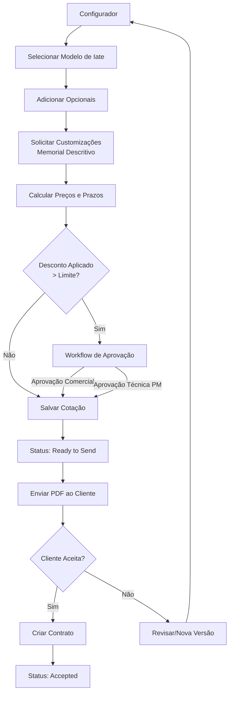
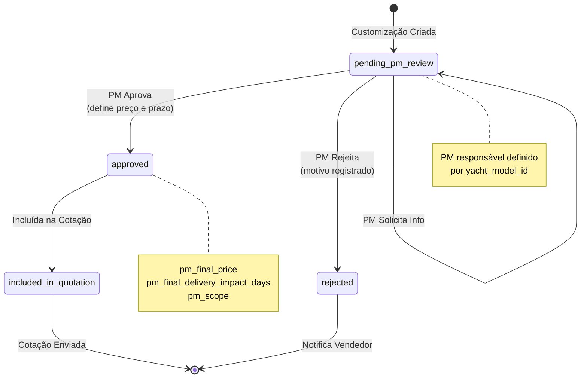
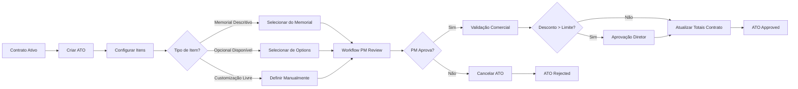
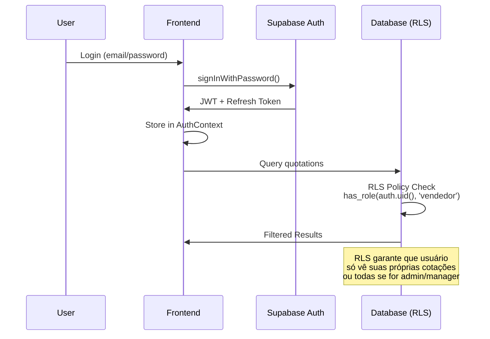

# 🏗️ Arquitetura do Sistema OKEAN CPQ

## Índice

1. [Visão Geral](#visão-geral)
2. [Stack Tecnológica](#stack-tecnológica)
3. [Estrutura de Diretórios](#estrutura-de-diretórios)
4. [Camadas da Aplicação](#camadas-da-aplicação)
5. [Fluxos Principais](#fluxos-principais)
6. [Padrões de Código](#padrões-de-código)
7. [Edge Functions](#edge-functions)
8. [Segurança](#segurança)
9. [Performance](#performance)
10. [Testes](#testes)
11. [Documentação Relacionada](#documentação-relacionada)

---

## Visão Geral

Sistema CPQ (Configure, Price, Quote) para gestão completa de cotações, contratos e aditivos na construção de iates personalizados. Desenvolvido com React + TypeScript + Supabase, focado em:

- **Configuração visual** de modelos e opcionais
- **Sistema de cotações** com descontos granulares
- **Workflow de aprovações** multinível (PM, Comercial, Técnico)
- **Gestão de customizações** com memorial descritivo
- **Contratos e ATOs** (Aditivos de Ordem)
- **Controle de acesso** baseado em roles (RBAC)

---

## Stack Tecnológica

### Frontend

| Camada | Tecnologia | Versão | Propósito |
|--------|-----------|--------|-----------|
| **Framework** | React | 18.3.1 | UI declarativa |
| **Linguagem** | TypeScript | 5.8.3 | Type safety |
| **Build** | Vite | 5.4.19 | Bundling rápido |
| **Routing** | React Router | 6.30.1 | Navegação SPA |
| **State** | React Query | 5.83.0 | Server state management |
| **Forms** | React Hook Form | 7.61.1 | Gestão de formulários |
| **Validation** | Zod | 3.25.76 | Schema validation |
| **UI** | shadcn/ui + Radix | Latest | Componentes acessíveis |
| **Styling** | TailwindCSS | Latest | Utility-first CSS |
| **Charts** | Recharts | 2.15.4 | Visualização de dados |
| **Virtualização** | TanStack Virtual | 3.13.12 | Listas performáticas |
| **Drag & Drop** | dnd-kit | 6.3.1 | Reordenação |

### Backend

| Camada | Tecnologia | Versão | Propósito |
|--------|-----------|--------|-----------|
| **BaaS** | Supabase | 2.76.1 | Backend completo |
| **Database** | PostgreSQL | 15.x | Dados relacionais |
| **Auth** | Supabase Auth | - | Autenticação JWT |
| **Storage** | Supabase Storage | - | Arquivos/imagens |
| **Functions** | Supabase Edge Functions | - | Lógica serverless (Deno) |
| **Realtime** | Supabase Realtime | - | Subscriptions |

### Testes

| Camada | Tecnologia | Versão | Propósito |
|--------|-----------|--------|-----------|
| **Unit** | Vitest | 1.6.1 | Testes unitários |
| **Integration** | Testing Library | 14.3.1 | Testes de componentes |
| **E2E** | Playwright | 1.56.1 | Testes end-to-end |
| **Environment** | Happy DOM | 13.10.1 | DOM para testes |

---

## Estrutura de Diretórios

```
okean-cpq/
├── src/
│   ├── components/              # 150+ Componentes React
│   │   ├── ui/                  # 40+ Base components (shadcn/ui - READ ONLY)
│   │   │   ├── button.tsx
│   │   │   ├── dialog.tsx
│   │   │   ├── card.tsx
│   │   │   └── ...
│   │   ├── quotations/          # 10 componentes de cotações
│   │   │   ├── QuotationsDashboard.tsx
│   │   │   ├── QuotationHeroSection.tsx
│   │   │   ├── CustomizationWorkflowCard.tsx
│   │   │   └── ...
│   │   ├── contracts/           # 15 componentes de contratos
│   │   │   ├── ContractsDashboard.tsx
│   │   │   ├── ATOsList.tsx
│   │   │   ├── CreateATODialog.tsx
│   │   │   └── ...
│   │   ├── configurator/        # 12 componentes do configurador
│   │   │   ├── ModelSelector.tsx
│   │   │   ├── OptionCard.tsx
│   │   │   ├── MemorialDescritivo.tsx
│   │   │   └── ...
│   │   ├── admin/               # 20+ componentes administrativos
│   │   │   ├── CreateUserDialog.tsx
│   │   │   ├── UserMenu.tsx
│   │   │   ├── memorial/        # Gestão de memorial
│   │   │   ├── options/         # Gestão de opções
│   │   │   └── yacht-models/    # Gestão de modelos
│   │   ├── approvals/           # Aprovações
│   │   ├── clients/             # Gestão de clientes
│   │   ├── AdminLayout.tsx      # Layout administrativo
│   │   ├── AppHeader.tsx        # Header global
│   │   └── ProtectedRoute.tsx   # Rota protegida
│   │
│   ├── hooks/                   # 48 Custom hooks
│   │   ├── quotations/          # Hooks refatorados
│   │   │   ├── useQuotationPricing.ts
│   │   │   ├── useQuotationValidation.ts
│   │   │   ├── useQuotationOptions.ts
│   │   │   ├── useQuotationCustomizations.ts
│   │   │   └── tests/           # Testes unitários
│   │   ├── useQuotations.ts
│   │   ├── useContracts.ts
│   │   ├── useATOs.ts
│   │   ├── useCustomizationWorkflow.ts
│   │   ├── useSimplifiedWorkflow.ts
│   │   ├── useYachtModels.ts
│   │   ├── useOptions.ts
│   │   ├── useMemorialItems.ts
│   │   ├── useClients.ts
│   │   ├── useUserRole.ts
│   │   └── ...
│   │
│   ├── pages/                   # 27 Páginas
│   │   ├── Index.tsx            # Dashboard principal
│   │   ├── Quotations.tsx       # Lista de cotações
│   │   ├── QuotationDetail.tsx  # Detalhe de cotação
│   │   ├── Configurator.tsx     # Configurador de iates
│   │   ├── Contracts.tsx        # Lista de contratos
│   │   ├── ContractDetail.tsx   # Detalhe de contrato
│   │   ├── Clients.tsx          # Gestão de clientes
│   │   ├── Approvals.tsx        # Aprovações pendentes
│   │   ├── WorkflowTasks.tsx    # Tarefas de workflow
│   │   ├── Profile.tsx          # Perfil do usuário
│   │   ├── Auth.tsx             # Login/cadastro
│   │   ├── Admin.tsx            # Dashboard admin
│   │   ├── AdminUsers.tsx       # Gestão de usuários
│   │   ├── AdminYachtModels.tsx # Gestão de modelos
│   │   ├── AdminOptions.tsx     # Gestão de opções
│   │   ├── AdminMemorialCategories.tsx
│   │   ├── AdminDiscountSettings.tsx
│   │   ├── AdminApprovalSettings.tsx
│   │   ├── AdminWorkflowSettings.tsx
│   │   ├── AdminAuditLogs.tsx
│   │   └── ...
│   │
│   ├── contexts/                # Contextos React
│   │   └── AuthContext.tsx      # Estado global de autenticação
│   │
│   ├── lib/                     # Utilitários e helpers
│   │   ├── approval-utils.ts    # Lógica de aprovações
│   │   ├── quotation-utils.ts   # Cálculos de cotações
│   │   ├── contract-utils.ts    # Utilitários de contratos
│   │   ├── customization-utils.ts
│   │   ├── formatters.ts        # Formatação (moeda, data)
│   │   ├── role-permissions.ts  # Mapa de permissões
│   │   ├── utils.ts             # Utilitários gerais (cn)
│   │   └── schemas/             # Schemas Zod
│   │       ├── profile-schema.ts
│   │       └── yacht-model-schema.ts
│   │
│   ├── integrations/            # Integrações externas
│   │   └── supabase/
│   │       ├── client.ts        # Cliente Supabase
│   │       └── types.ts         # Tipos auto-gerados (READ ONLY)
│   │
│   ├── test/                    # Configuração de testes
│   │   ├── setup.ts
│   │   ├── types.ts
│   │   └── utils.tsx
│   │
│   ├── types/                   # Tipos TypeScript
│   │   └── memorial.ts
│   │
│   ├── App.tsx                  # App principal
│   ├── main.tsx                 # Entry point
│   └── index.css                # Design system tokens
│
├── supabase/
│   ├── functions/               # 17 Edge Functions
│   │   ├── create-user/
│   │   ├── update-user/
│   │   ├── advance-customization-workflow/
│   │   ├── advance-ato-workflow/
│   │   ├── create-contract-from-quotation/
│   │   ├── convert-customization-to-ato/
│   │   ├── generate-quotation-pdf/
│   │   ├── generate-contract-pdf/
│   │   ├── generate-ato-pdf/
│   │   ├── generate-original-contract-pdf/
│   │   ├── send-quotation-email/
│   │   ├── send-contract-email/
│   │   ├── send-workflow-notification/
│   │   ├── check-expiring-quotations/
│   │   ├── extract-yacht-specs/
│   │   ├── create-fy850-options/
│   │   └── migrate-options-to-exclusive/
│   ├── migrations/              # Migrations SQL (50+)
│   └── config.toml              # Configuração Supabase
│
├── e2e/                         # Testes E2E
│   ├── quotation-create.spec.ts
│   ├── responsiveness.spec.ts
│   └── workflow-migration.spec.ts
│
├── docs/                        # Documentação
│   ├── DATABASE.md              # Schema do banco
│   ├── ARCHITECTURE.md          # Este arquivo
│   ├── WORKFLOW_SIMPLIFICADO.md
│   └── TESTING_RESPONSIVENESS.md
│
└── CONTRIBUTING.md              # Guia de contribuição
```

---

## Camadas da Aplicação

```
┌─────────────────────────────────────────────────────────────┐
│                    APRESENTAÇÃO (UI)                         │
│  • React Components (150+)                                   │
│  • shadcn/ui + Radix UI (acessibilidade)                    │
│  • TailwindCSS (design system tokens)                       │
│  • React Router v6 (navegação)                              │
├─────────────────────────────────────────────────────────────┤
│               LÓGICA DE NEGÓCIO (Hooks)                      │
│  • React Query (server state + cache)                       │
│  • Custom Hooks (48 hooks)                                  │
│  • Zod Validation (schemas + runtime checks)                │
│  • Cálculos (pricing, discounts, delivery)                  │
├─────────────────────────────────────────────────────────────┤
│                  EDGE FUNCTIONS (17)                         │
│  • Deno Runtime (TypeScript)                                │
│  • PDF Generation (Puppeteer)                               │
│  • Email Sending (Resend)                                   │
│  • Workflow Orchestration                                   │
├─────────────────────────────────────────────────────────────┤
│                    DADOS (Supabase)                          │
│  • PostgreSQL 15.x (24 tabelas + 5 views)                   │
│  • Row Level Security (RLS em todas as tabelas)             │
│  • Supabase Auth (JWT + refresh tokens)                     │
│  • Supabase Storage (3 buckets)                             │
│  • Realtime (subscriptions - opcional)                      │
└─────────────────────────────────────────────────────────────┘
```

### Responsabilidades por Camada

| Camada | Responsabilidades | Não deve fazer |
|--------|-------------------|----------------|
| **UI** | Renderização, eventos de usuário, navegação | Lógica de negócio, queries diretas |
| **Hooks** | Queries, mutations, validação, cálculos | Manipulação direta do DOM |
| **Edge Functions** | Lógica server-side, integrações externas, segurança | Operações client-side |
| **Dados** | Persistência, RLS, transações | Lógica de negócio complexa |

---

## Fluxos Principais

### 1. Fluxo de Cotação



### 2. Fluxo de Workflow de Customizações



### 3. Fluxo de ATOs (Aditivos de Ordem)



### 4. Fluxo de Autenticação e Autorização



---

## Padrões de Código

### Hooks Customizados

**Convenção de Nomenclatura:**

```typescript
// ✅ Queries: use + Entidade (plural para listas)
export function useQuotations()       // Lista de cotações
export function useQuotation(id)      // Detalhe de uma cotação
export function useYachtModels()      // Lista de modelos

// ✅ Mutations: use + Ação + Entidade
export function useSaveQuotation()
export function useDeleteQuotation()
export function useDuplicateQuotation()
export function useCreateContract()

// ✅ Cálculos/Validação: Função pura + Hook wrapper
export function calculateQuotationPricing(input)  // Função pura
export function useQuotationPricing(input)        // Hook com useMemo

export function validateQuotation(input)          // Função pura
export function useQuotationValidation(input)     // Hook wrapper
```

**Estrutura Padrão de Hook:**

```typescript
import { useQuery, useMutation, useQueryClient } from "@tanstack/react-query";
import { supabase } from "@/integrations/supabase/client";

// Query Hook
export function useQuotations() {
  return useQuery({
    queryKey: ['quotations'],
    queryFn: async () => {
      const { data, error } = await supabase
        .from('quotations')
        .select(`
          *,
          client:clients(name, email),
          yacht_model:yacht_models(name, base_price)
        `)
        .order('created_at', { ascending: false });
      
      if (error) throw error;
      return data;
    },
  });
}

// Mutation Hook
export function useDeleteQuotation() {
  const queryClient = useQueryClient();

  return useMutation({
    mutationFn: async (quotationId: string) => {
      const { error } = await supabase
        .from('quotations')
        .delete()
        .eq('id', quotationId);
      
      if (error) throw error;
    },
    onSuccess: () => {
      // Invalidar cache para refetch
      queryClient.invalidateQueries({ queryKey: ['quotations'] });
    },
  });
}
```

### Componentes React

**Convenção de Nomenclatura:**

```typescript
// ✅ PascalCase para componentes
QuotationCard.tsx
CustomizationWorkflowCard.tsx
CreateUserDialog.tsx

// ✅ Props com interface TypeScript
interface QuotationCardProps {
  quotation: Quotation;
  onSelect?: (id: string) => void;
  showActions?: boolean;
}

// ✅ Named export preferencial
export function QuotationCard({ quotation, onSelect, showActions = true }: QuotationCardProps) {
  // Early returns para casos especiais
  if (!quotation) {
    return <EmptyState message="Cotação não encontrada" />;
  }

  // Lógica de renderização
  return (
    <Card>
      <CardHeader>
        <CardTitle>{quotation.quotation_number}</CardTitle>
      </CardHeader>
      {/* ... */}
    </Card>
  );
}
```

### Queries Supabase

**Evitar N+1 Queries:**

```typescript
// ❌ N+1 problem
const { data: quotations } = await supabase.from('quotations').select('*');
for (const q of quotations) {
  const { data: client } = await supabase
    .from('clients')
    .select('*')
    .eq('id', q.client_id)
    .single();
}

// ✅ Join/select com relacionamento
const { data } = await supabase
  .from('quotations')
  .select(`
    *,
    client:clients(name, email, phone),
    yacht_model:yacht_models(name, base_price),
    quotation_options(
      option:options(name, base_price),
      quantity,
      total_price
    )
  `);
```

---

## Edge Functions

### Lista de Funções (17 total)

| Função | Propósito | Requer Auth | Triggers |
|--------|-----------|-------------|----------|
| **create-user** | Cria usuário com roles | ✅ Admin | Manual |
| **update-user** | Atualiza usuário e roles | ✅ Admin | Manual |
| **advance-customization-workflow** | Avança step de customização | ✅ PM/Admin | Manual |
| **advance-ato-workflow** | Avança step de ATO | ✅ PM/Admin | Manual |
| **create-contract-from-quotation** | Gera contrato a partir de cotação aceita | ✅ Vendedor | Manual |
| **convert-customization-to-ato** | Converte customização aprovada em ATO | ✅ Comercial | Manual |
| **generate-quotation-pdf** | Gera PDF da cotação | ✅ Vendedor | Manual |
| **generate-contract-pdf** | Gera PDF do contrato | ✅ Vendedor | Manual |
| **generate-ato-pdf** | Gera PDF do ATO | ✅ Vendedor | Manual |
| **generate-original-contract-pdf** | PDF do contrato original (sem ATOs) | ✅ Vendedor | Manual |
| **send-quotation-email** | Envia cotação por email (Resend) | ✅ Vendedor | Manual |
| **send-contract-email** | Envia contrato por email | ✅ Vendedor | Manual |
| **send-workflow-notification** | Notifica usuário sobre workflow | ✅ Sistema | Automático |
| **check-expiring-quotations** | Verifica cotações próximas do vencimento | ⏰ Cron | Daily |
| **extract-yacht-specs** | Extrai especificações técnicas de documento | ✅ Admin | Manual |
| **create-fy850-options** | Seed de opções para modelo FY850 | ✅ Admin | Manual |
| **migrate-options-to-exclusive** | Migration de dados (opcional → exclusivo) | ✅ Admin | Manual |

### Padrão de Edge Function

```typescript
// supabase/functions/my-function/index.ts
import { createClient } from 'https://esm.sh/@supabase/supabase-js@2';

const corsHeaders = {
  'Access-Control-Allow-Origin': '*',
  'Access-Control-Allow-Headers': 'authorization, x-client-info, apikey, content-type',
};

Deno.serve(async (req) => {
  // Handle CORS preflight
  if (req.method === 'OPTIONS') {
    return new Response(null, { headers: corsHeaders });
  }

  try {
    // Criar cliente Supabase com service role (bypass RLS)
    const supabase = createClient(
      Deno.env.get('SUPABASE_URL')!,
      Deno.env.get('SUPABASE_SERVICE_ROLE_KEY')!
    );

    // Validar autenticação
    const authHeader = req.headers.get('Authorization')!;
    const { data: { user }, error: authError } = await supabase.auth.getUser(
      authHeader.replace('Bearer ', '')
    );

    if (authError || !user) {
      throw new Error('Unauthorized');
    }

    // Lógica da função
    const body = await req.json();
    // ...

    return new Response(
      JSON.stringify({ success: true, data: result }),
      { headers: { ...corsHeaders, 'Content-Type': 'application/json' } }
    );

  } catch (error) {
    console.error('Error:', error);
    return new Response(
      JSON.stringify({ error: error.message }),
      { 
        status: 400,
        headers: { ...corsHeaders, 'Content-Type': 'application/json' }
      }
    );
  }
});
```

---

## Segurança

### Row Level Security (RLS)

**Todas as 24+ tabelas possuem RLS habilitado.**

**Padrão de Políticas:**

| Operação | Política | Exemplo |
|----------|----------|---------|
| SELECT | Dados públicos ou próprios | `is_active = true` ou `created_by = auth.uid()` |
| INSERT | Apenas dados próprios | `created_by = auth.uid()` |
| UPDATE | Dados próprios em status editável | `created_by = auth.uid() AND status = 'draft'` |
| DELETE | Apenas admin | `has_role(auth.uid(), 'administrador')` |

**Função Crítica para RBAC:**

```sql
-- Evita recursão em RLS usando SECURITY DEFINER
CREATE OR REPLACE FUNCTION has_role(_user_id uuid, _role app_role)
RETURNS boolean
LANGUAGE sql
STABLE SECURITY DEFINER
SET search_path TO 'public'
AS $$
  SELECT EXISTS (
    SELECT 1
    FROM public.user_roles
    WHERE user_id = _user_id
      AND role = _role
  )
$$;
```

**Exemplo de Policy:**

```sql
-- Vendedores veem apenas suas cotações
CREATE POLICY "Users can view their own quotations"
  ON quotations FOR SELECT
  USING (
    sales_representative_id = auth.uid() OR
    has_role(auth.uid(), 'gerente_comercial') OR
    has_role(auth.uid(), 'administrador')
  );

-- Apenas admin pode deletar
CREATE POLICY "Admins can delete quotations"
  ON quotations FOR DELETE
  USING (has_role(auth.uid(), 'administrador'));
```

### Autenticação

**JWT Tokens via Supabase Auth:**

- **Access Token**: Válido por 1 hora
- **Refresh Token**: Renova automaticamente
- **Context Global**: `AuthContext.tsx` gerencia estado
- **Rotas Protegidas**: `ProtectedRoute.tsx` verifica auth

**Exemplo de Uso:**

```typescript
import { ProtectedRoute } from "@/components/ProtectedRoute";

<Route
  path="/admin"
  element={
    <ProtectedRoute requiredRoles={['administrador']}>
      <AdminPage />
    </ProtectedRoute>
  }
/>
```

### Storage Buckets

| Bucket | Público | RLS Policy | Uso |
|--------|---------|------------|-----|
| `yacht-images` | ✅ Sim | Leitura pública | Imagens de modelos |
| `customization-files` | ❌ Não | Apenas autorizados | Arquivos de customizações |
| `quotation-pdfs` | ✅ Sim | Link com token | PDFs gerados |

---

## Performance

### Otimizações Implementadas

| Otimização | Descrição | Impacto | Sprint |
|------------|-----------|---------|--------|
| **Views SQL** | `admin_dashboard_stats`, `contract_stats`, `quotation_stats` | 6 queries → 1 query | Sprint 3 |
| **React Query Cache** | `staleTime: 5 minutos` para dados estáticos | Menos requests ao servidor | Sprint 1 |
| **Virtualização** | `@tanstack/react-virtual` para listas grandes | Renderiza apenas itens visíveis | Sprint 3 |
| **Memoização** | `useMemo` em hooks de pricing/validação | Evita recálculos desnecessários | Sprint 2 |
| **Lazy Loading** | Code splitting por rotas | Bundle inicial <200KB | Sprint 3 |
| **Índices DB** | Em `status`, `created_at`, `yacht_model_id` | Queries 3-5x mais rápidas | Sprint 3 |
| **Debounce** | Em filtros de pesquisa | Reduz queries durante digitação | Sprint 2 |

### Métricas de Performance

**Targets:**

- First Contentful Paint: **<1s**
- Time to Interactive: **<2s**
- Lighthouse Score: **>90**
- Bundle Size (inicial): **<200KB**

**Monitoramento:**

```bash
# Build analysis
npm run build -- --analyze

# Lighthouse
npm run lighthouse

# Bundle size
npm run build && ls -lh dist/assets/*.js
```

---

## Testes

### Estrutura

```
src/hooks/quotations/tests/         # Testes unitários
  ├── useQuotationPricing.test.ts
  ├── useQuotationValidation.test.ts
  └── ...

e2e/                                # Testes E2E (Playwright)
  ├── quotation-create.spec.ts
  ├── responsiveness.spec.ts
  └── workflow-migration.spec.ts

src/test/                           # Configuração
  ├── setup.ts
  ├── types.ts
  └── utils.tsx
```

### Ferramentas

| Tool | Propósito | Comando |
|------|-----------|---------|
| **Vitest** | Testes unitários | `npm run test` |
| **Testing Library** | Testes de componentes | `npm run test` |
| **Playwright** | Testes E2E | `npm run test:e2e` |
| **Happy DOM** | Ambiente de teste (mais rápido que jsdom) | - |
| **Coverage** | Cobertura de código | `npm run test:coverage` |

### Cobertura de Testes

**Targets:**

- **Hooks críticos**: >70%
- **Fluxos principais**: E2E completo
- **Componentes**: Testes de integração seletivos

**Exemplo de Teste:**

```typescript
// src/hooks/quotations/tests/useQuotationPricing.test.ts
import { describe, it, expect } from 'vitest';
import { calculateQuotationPricing } from '../useQuotationPricing';

describe('calculateQuotationPricing', () => {
  it('should calculate total price correctly', () => {
    const result = calculateQuotationPricing({
      basePrice: 1000000,
      baseDiscountPercentage: 10,
      baseDeliveryDays: 365,
      selectedOptions: [
        { unitPrice: 50000, quantity: 2, deliveryDaysImpact: 30 }
      ],
      optionsDiscountPercentage: 5,
    });

    expect(result.finalBasePrice).toBe(900000); // 1M - 10%
    expect(result.finalOptionsPrice).toBe(95000); // (50k * 2) - 5%
    expect(result.finalTotalPrice).toBe(995000);
    expect(result.totalDeliveryDays).toBe(395); // 365 + 30
  });
});
```

---

## Documentação Relacionada

### Documentos Principais

- **[DATABASE.md](./DATABASE.md)** - Schema completo do banco de dados
  - 24 tabelas detalhadas
  - 5 views de otimização
  - 12 funções SQL
  - Políticas RLS
  - Diagramas ER

- **[WORKFLOW_SIMPLIFICADO.md](./WORKFLOW_SIMPLIFICADO.md)** - Fluxos de aprovação
  - Workflow de customizações
  - Workflow de ATOs
  - Estados e transições

- **[TESTING_RESPONSIVENESS.md](./TESTING_RESPONSIVENESS.md)** - Testes de responsividade
  - Breakpoints
  - Guidelines mobile-first

- **[CONTRIBUTING.md](../CONTRIBUTING.md)** - Guia completo de contribuição
  - Padrões de código
  - Design system
  - Convenções de commit
  - Troubleshooting

### Links Externos

- **Supabase Dashboard**: `https://supabase.com/dashboard/project/qqxhkaowexieednyazwq`
- **React Query Docs**: `https://tanstack.com/query/latest/docs/react/overview`
- **shadcn/ui**: `https://ui.shadcn.com/`
- **Tailwind CSS**: `https://tailwindcss.com/docs`

---

## Changelog

### v1.0.0 (2025-01-27)

- **Criação inicial** da documentação de arquitetura
- Mapeamento completo de 150+ componentes
- Documentação de 48 hooks customizados
- Listagem de 17 Edge Functions
- Diagramas de fluxo (Mermaid)
- Padrões de código estabelecidos

---

**Última atualização:** 2025-01-27  
**Versão:** 1.0.0  
**Mantenedores:** Time de Engenharia OKEAN
