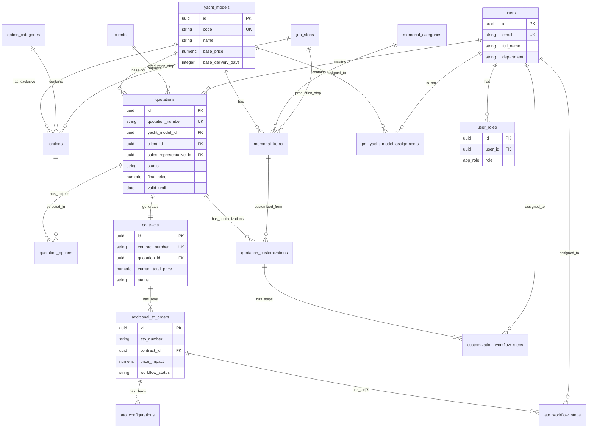

# 🗄️ Documentação do Banco de Dados - OKEAN CPQ

## Índice

1. [Visão Geral](#visão-geral)
2. [Tabelas Principais](#tabelas-principais)
   - [Cotações e Contratos](#cotações-e-contratos)
   - [Catálogo de Produtos](#catálogo-de-produtos)
   - [Workflow e Aprovações](#workflow-e-aprovações)
   - [Usuários e Permissões](#usuários-e-permissões)
   - [Auditoria](#auditoria)
3. [Views de Otimização](#views-de-otimização)
4. [Enums (Tipos Personalizados)](#enums-tipos-personalizados)
5. [Funções de Banco de Dados](#funções-de-banco-de-dados)
6. [Índices de Performance](#índices-de-performance)
7. [Diagrama de Relacionamentos (ER)](#diagrama-de-relacionamentos-er)
8. [Segurança (Row Level Security)](#segurança-row-level-security)
9. [Storage Buckets](#storage-buckets)
10. [Edge Functions Relacionadas](#edge-functions-relacionadas)

---

## Visão Geral

O banco de dados do sistema OKEAN CPQ é hospedado no **Supabase** (PostgreSQL 15+) e utiliza **Row Level Security (RLS)** para proteção granular de dados.

**Características principais:**
- ✅ RLS habilitado em todas as tabelas sensíveis
- ✅ Funções `SECURITY DEFINER` para evitar recursão em políticas
- ✅ Auditoria automática de mudanças críticas
- ✅ Views materializadas para performance de dashboards
- ✅ Enums tipados para garantir consistência de dados

**Projeto Supabase:**
- **Project ID:** `qqxhkaowexieednyazwq`
- **Region:** South America (São Paulo)
- **PostgreSQL Version:** 15.x

---

## Tabelas Principais

### Cotações e Contratos

| Tabela | Descrição | Colunas Principais | Observações |
|--------|-----------|-------------------|-------------|
| **quotations** | Cotações criadas no configurador | `id`, `quotation_number`, `status`, `final_price`, `valid_until`, `base_price`, `total_delivery_days` | Status: draft, sent, accepted, expired, cancelled |
| **quotation_options** | Opcionais selecionados em cada cotação | `quotation_id`, `option_id`, `quantity`, `unit_price`, `total_price`, `delivery_days_impact` | Calculado automaticamente ao salvar |
| **quotation_customizations** | Customizações técnicas solicitadas | `quotation_id`, `item_name`, `workflow_status`, `pm_final_price`, `pm_scope`, `engineering_notes` | Workflow: pending_pm_review → pending_supply → approved |
| **contracts** | Contratos gerados de cotações aceitas | `id`, `contract_number`, `quotation_id`, `current_total_price`, `status`, `signed_at` | Criado via Edge Function |
| **additional_to_orders** | Aditivos (ATOs) vinculados a contratos | `ato_number`, `contract_id`, `price_impact`, `workflow_status`, `requires_approval` | ATOs podem adicionar ou subtrair valor |
| **ato_configurations** | Itens individuais de cada ATO | `ato_id`, `item_type`, `item_id`, `configuration_details`, `sub_items` | item_type: option, memorial_item, free_customization |
| **clients** | Dados de clientes | `name`, `email`, `phone`, `company`, `cpf` | Usado em cotações e contratos |

**Relacionamento principal:**
```
quotation → quotation_options (1:N)
quotation → quotation_customizations (1:N)
quotation → contracts (1:1)
contract → additional_to_orders (1:N)
ato → ato_configurations (1:N)
```

---

### Catálogo de Produtos

| Tabela | Descrição | Colunas Principais | Observações |
|--------|-----------|-------------------|-------------|
| **yacht_models** | Modelos de iates disponíveis | `name`, `code`, `base_price`, `base_delivery_days`, `technical_specifications`, `display_order` | Apenas `is_active=true` aparecem no catálogo |
| **memorial_categories** | Categorias do memorial descritivo | `value`, `label`, `description`, `icon`, `display_order` | Ex: salao, flybridge, cabine_master |
| **memorial_items** | Itens padrão do memorial por modelo | `yacht_model_id`, `category_id`, `item_name`, `quantity`, `brand`, `model`, `is_customizable` | Base do memorial descritivo |
| **option_categories** | Categorias de opcionais | `name`, `description`, `display_order` | Ex: Conforto, Náutica, Segurança |
| **options** | Opcionais disponíveis | `code`, `name`, `base_price`, `delivery_days_impact`, `yacht_model_id`, `is_configurable` | Pode ser exclusivo de modelo ou genérico |
| **job_stops** | Pontos de parada na produção | `name`, `description`, `display_order` | Usado para agrupar itens por departamento |

**Relacionamento principal:**
```
yacht_model → memorial_items (1:N)
yacht_model → options (1:N) (se yacht_model_id não for NULL)
memorial_category → memorial_items (1:N)
option_category → options (1:N)
job_stop → memorial_items (1:N)
job_stop → options (1:N)
```

---

### Workflow e Aprovações

| Tabela | Descrição | Colunas Principais | Observações |
|--------|-----------|-------------------|-------------|
| **customization_workflow_steps** | Histórico de aprovações de customizações | `customization_id`, `step_type`, `status`, `assigned_to`, `response_data`, `completed_at` | step_type: pm_review, supply, planning, commercial |
| **ato_workflow_steps** | Histórico de aprovações de ATOs | `ato_id`, `step_type`, `status`, `assigned_to`, `response_data` | Similar ao de customizações |
| **workflow_config** | Configurações globais do workflow | `config_key`, `config_value` (jsonb) | Ex: SLA deadlines, escalation rules |
| **workflow_settings** | Settings habilitáveis por admin | `setting_key`, `enabled`, `config_data` | Controla features opcionais |

**Fluxo de Aprovação (Customizações):**
```
1. Criada → pending_pm_review (PM analisa escopo e preço)
2. PM aprova → pending_supply (Comprador valida fornecimento)
3. Supply aprova → pending_planning (Planejamento define janela)
4. Planning aprova → pending_commercial (Gerente valida preço final)
5. Commercial aprova → approved (Customização aprovada)
```

---

### Usuários e Permissões

| Tabela | Descrição | Colunas Principais | Notas de Segurança |
|--------|-----------|-------------------|-------------------|
| **users** | Perfis de usuários do sistema | `id` (FK auth.users), `email`, `full_name`, `department`, `is_active` | **Não armazena roles** (segurança) |
| **user_roles** | Papéis (RBAC) | `user_id`, `role` (enum app_role) | ⚠️ **Tabela separada por segurança** |
| **role_permissions_config** | Permissões granulares por role | `role`, `permission`, `is_granted`, `is_default` | Configurável por admin |
| **discount_limits_config** | Limites de desconto por cargo | `limit_type` (base/options), `no_approval_max`, `director_approval_max` | Usado para validar descontos |
| **pm_yacht_model_assignments** | PMs responsáveis por modelo | `pm_user_id`, `yacht_model_id` | 1 PM por modelo |

**⚠️ Segurança Crítica:**
- Roles **NUNCA** são armazenados em `users` ou `profiles` para evitar privilege escalation
- Usa função `has_role(user_id, role)` SECURITY DEFINER para evitar recursão em RLS

---

### Auditoria

| Tabela | Descrição | Colunas Principais | Retenção |
|--------|-----------|-------------------|----------|
| **audit_logs** | Log de alterações em tabelas auditadas | `user_id`, `action`, `table_name`, `record_id`, `old_values`, `new_values`, `changed_fields`, `created_at` | 90 dias |
| **approvals_backup** | Backup de sistema antigo de aprovações | (todas as colunas) | Apenas leitura |

**Tabelas auditadas:**
- `quotations`
- `contracts`
- `additional_to_orders`
- `users`
- `user_roles`
- `discount_limits_config`

**Trigger automático:**
```sql
CREATE TRIGGER audit_quotations
AFTER INSERT OR UPDATE OR DELETE ON quotations
FOR EACH ROW EXECUTE FUNCTION audit_trigger_func();
```

---

## Views de Otimização

| View | Propósito | Usado Por | Atualização |
|------|-----------|-----------|-------------|
| **quotation_stats** | Contadores de cotações por status (draft, sent, accepted, etc) | `QuotationsDashboard.tsx` | Real-time |
| **contract_stats** | Estatísticas de contratos e ATOs (total revenue, avg delivery, etc) | `useContractStats.ts` | Real-time |
| **admin_dashboard_stats** | Contadores gerais (modelos, opções, usuários, cotações, contratos) | `useStats.ts` | Real-time |
| **workflow_pending_tasks** | Tarefas pendentes por departamento (PM, supply, planning, commercial) | Cards de dashboard | Real-time |
| **live_contracts** | Contratos com totais calculados incluindo ATOs aprovadas | `ContractDetail.tsx` | Real-time |

**Exemplo de uso:**
```typescript
// Hook que usa view otimizada
const { data: stats } = useQuery({
  queryKey: ['quotation-stats'],
  queryFn: async () => {
    const { data } = await supabase
      .from('quotation_stats')
      .select('*')
      .single();
    return data;
  }
});
```

---

## Enums (Tipos Personalizados)

### app_role
```sql
CREATE TYPE app_role AS ENUM (
  'administrador',
  'gerente_comercial',
  'diretor_comercial',
  'pm_engenharia',
  'comprador',
  'planejador',
  'broker',
  'backoffice_comercial',
  'comercial',
  'producao',
  'financeiro'
);
```

### approval_status
```sql
CREATE TYPE approval_status AS ENUM (
  'pending',
  'approved',
  'rejected'
);
```

### approval_type
```sql
CREATE TYPE approval_type AS ENUM (
  'discount',
  'customization',
  'commercial',
  'technical'
);
```

### department_type
```sql
CREATE TYPE department_type AS ENUM (
  'commercial',
  'engineering',
  'supply',
  'planning',
  'backoffice'
);
```

### memorial_category
```sql
CREATE TYPE memorial_category AS ENUM (
  -- Áreas principais
  'conves_principal',
  'deck_principal',
  'plataforma_popa',
  'flybridge',
  
  -- Áreas internas
  'salao',
  'area_jantar',
  'lavabo',
  'cozinha_galley',
  'comando_principal',
  
  -- Cabines
  'cabine_master',
  'cabine_vip',
  'cabine_vip_proa',
  'cabine_hospedes_bombordo',
  'cabine_hospedes_boreste',
  'cabine_capitao',
  'cabine_tripulacao',
  
  -- Banheiros
  'banheiro_master',
  'banheiro_vip',
  'banheiro_hospedes_bombordo',
  'banheiro_hospedes_boreste',
  'banheiro_hospedes_compartilhado',
  'banheiro_capitao',
  'banheiro_tripulacao',
  
  -- Áreas técnicas
  'sala_maquinas',
  'garagem',
  'lobby_conves_inferior',
  'lobby_tripulacao',
  
  -- Sistemas
  'propulsao_controle',
  'sistema_estabilizacao',
  'equipamentos_eletronicos',
  'sistema_extincao_incendio',
  'sistema_ar_condicionado',
  'sistema_bombas_porao',
  'sistema_agua_sanitario',
  'eletrica',
  'audiovisual_entretenimento',
  
  -- Estrutura
  'casco_estrutura',
  'caracteristicas_externas',
  'navegacao',
  'cockpit',
  
  -- Outros
  'outros'
);
```

---

## Funções de Banco de Dados

### Funções de Segurança (SECURITY DEFINER)

| Função | Retorno | Propósito | Exemplo de Uso |
|--------|---------|-----------|----------------|
| `has_role(user_id uuid, role app_role)` | boolean | Verifica se usuário tem role específica (evita recursão RLS) | `has_role(auth.uid(), 'administrador')` |
| `is_admin()` | boolean | Verifica se usuário atual é admin | `is_admin()` |
| `get_effective_permissions(user_id uuid)` | TABLE(permission text) | Retorna todas permissões efetivas do usuário | `SELECT * FROM get_effective_permissions(auth.uid())` |

**⚠️ Por que SECURITY DEFINER?**
```sql
-- ❌ ERRADO: Causa recursão infinita em RLS
CREATE POLICY "Admins can view all" ON profiles
FOR SELECT USING (
  (SELECT role FROM profiles WHERE id = auth.uid()) = 'admin'
);

-- ✅ CORRETO: Usa função SECURITY DEFINER
CREATE POLICY "Admins can view all" ON profiles
FOR SELECT USING (has_role(auth.uid(), 'administrador'));
```

### Triggers Automáticos

| Função | Tipo | Tabela | Ação |
|--------|------|--------|------|
| `update_updated_at_column()` | TRIGGER | Todas com `updated_at` | Atualiza timestamp antes de UPDATE |
| `handle_new_user()` | TRIGGER | auth.users | Cria perfil em `users` ao registrar |
| `audit_trigger_func()` | TRIGGER | Tabelas auditadas | Registra mudanças em `audit_logs` |
| `create_customization_workflow_step()` | TRIGGER | quotation_customizations | Cria step inicial de PM review |
| `create_ato_workflow_steps()` | TRIGGER | additional_to_orders | Cria step inicial de PM review para ATO |

### Funções Utilitárias

| Função | Retorno | Propósito |
|--------|---------|-----------|
| `get_yacht_model_id(modelo_text text)` | uuid | Busca modelo por código ou nome (fuzzy matching) |
| `normalize_memorial_category(okean_categoria text)` | text | Normaliza nome de categoria OKEAN para enum |
| `update_yacht_models_order(updates jsonb)` | void | Atualiza `display_order` de múltiplos modelos |
| `reset_role_permissions_to_default(role app_role)` | void | Reseta permissões de uma role para padrão |

**Exemplo de uso:**
```typescript
// Buscar modelo por código
const { data } = await supabase.rpc('get_yacht_model_id', {
  modelo_text: 'FY850'
});
```

---

## Índices de Performance

### Quotations
```sql
CREATE INDEX idx_quotations_status ON quotations(status);
CREATE INDEX idx_quotations_valid_until ON quotations(valid_until);
CREATE INDEX idx_quotations_created_at ON quotations(created_at DESC);
CREATE INDEX idx_quotations_sales_rep ON quotations(sales_representative_id);
CREATE INDEX idx_quotations_yacht_model ON quotations(yacht_model_id);
```

### Contracts
```sql
CREATE INDEX idx_contracts_status ON contracts(status);
CREATE INDEX idx_contracts_quotation ON contracts(quotation_id);
CREATE INDEX idx_contracts_created_at ON contracts(created_at DESC);
```

### ATOs
```sql
CREATE INDEX idx_atos_contract ON additional_to_orders(contract_id);
CREATE INDEX idx_atos_status ON additional_to_orders(status);
CREATE INDEX idx_atos_workflow_status ON additional_to_orders(workflow_status);
```

### Workflow Steps
```sql
CREATE INDEX idx_customization_steps_status 
  ON customization_workflow_steps(status);
CREATE INDEX idx_customization_steps_assigned 
  ON customization_workflow_steps(assigned_to) WHERE status = 'pending';

CREATE INDEX idx_ato_steps_status 
  ON ato_workflow_steps(status);
CREATE INDEX idx_ato_steps_assigned 
  ON ato_workflow_steps(assigned_to) WHERE status = 'pending';
```

### Audit Logs
```sql
CREATE INDEX idx_audit_logs_table_name ON audit_logs(table_name);
CREATE INDEX idx_audit_logs_record_id ON audit_logs(record_id);
CREATE INDEX idx_audit_logs_created_at ON audit_logs(created_at DESC);
CREATE INDEX idx_audit_logs_user_id ON audit_logs(user_id);
```

---

## Diagrama de Relacionamentos (ER)



---

## Segurança (Row Level Security)

### Padrão de Políticas

Todas as tabelas sensíveis possuem RLS habilitado:

```sql
ALTER TABLE quotations ENABLE ROW LEVEL SECURITY;
ALTER TABLE contracts ENABLE ROW LEVEL SECURITY;
ALTER TABLE user_roles ENABLE ROW LEVEL SECURITY;
-- etc...
```

### Tipos de Políticas Comuns

| Tipo | Condição | Exemplo de Uso |
|------|----------|----------------|
| **Público** | `is_active = true` | Catálogo de opcionais e modelos |
| **Próprio** | `created_by = auth.uid()` | Cotações do vendedor |
| **Departamento** | `has_role(auth.uid(), 'gerente_comercial')` | Gerente vê todas cotações |
| **Admin** | `has_role(auth.uid(), 'administrador')` | Acesso total |
| **Público via Token** | `secure_token IS NOT NULL` | Cotação pública para cliente |

### Exemplos de Políticas

**Quotations - SELECT:**
```sql
CREATE POLICY "Users can view their own quotations"
ON quotations FOR SELECT
USING (
  sales_representative_id = auth.uid() 
  OR has_role(auth.uid(), 'gerente_comercial') 
  OR has_role(auth.uid(), 'administrador')
);

-- Permite acesso público a cotações com token
CREATE POLICY "Allow public access with valid secure_token"
ON quotations FOR SELECT
USING (secure_token IS NOT NULL);
```

**Quotations - INSERT:**
```sql
CREATE POLICY "Users can create quotations"
ON quotations FOR INSERT
WITH CHECK (sales_representative_id = auth.uid());
```

**Quotations - UPDATE:**
```sql
CREATE POLICY "Users can update their own draft quotations"
ON quotations FOR UPDATE
USING (
  (sales_representative_id = auth.uid() AND status = 'draft')
  OR has_role(auth.uid(), 'administrador')
  OR has_role(auth.uid(), 'gerente_comercial')
);
```

**User Roles - SELECT:**
```sql
-- Apenas o próprio usuário vê suas roles
CREATE POLICY "Users can view their own roles"
ON user_roles FOR SELECT
USING (user_id = auth.uid());

-- Admins podem ver todas
CREATE POLICY "Admins can manage all roles"
ON user_roles FOR ALL
USING (has_role(auth.uid(), 'administrador'))
WITH CHECK (has_role(auth.uid(), 'administrador'));
```

### Função de Segurança Principal

```sql
CREATE OR REPLACE FUNCTION has_role(_user_id uuid, _role app_role)
RETURNS boolean
LANGUAGE sql
STABLE
SECURITY DEFINER
SET search_path = public
AS $$
  SELECT EXISTS (
    SELECT 1
    FROM public.user_roles
    WHERE user_id = _user_id
      AND role = _role
  )
$$;
```

**Por que usar SECURITY DEFINER?**
- Evita recursão infinita em RLS
- Executa com privilégios do owner (bypass de RLS temporário)
- Função pura, sem efeitos colaterais

---

## Storage Buckets

| Bucket | Público | Tamanho Max | Tipos Permitidos | Uso |
|--------|---------|-------------|------------------|-----|
| **yacht-images** | ✅ Sim | 10 MB | image/jpeg, image/png, image/webp | Imagens de modelos de iates |
| **customization-files** | ❌ Não | 50 MB | application/pdf, image/*, application/zip | Anexos de customizações técnicas |
| **quotation-pdfs** | ✅ Sim | 5 MB | application/pdf | PDFs gerados de cotações |

### Políticas de Storage

**yacht-images (público):**
```sql
-- Qualquer pessoa pode visualizar
CREATE POLICY "Public can view yacht images"
ON storage.objects FOR SELECT
USING (bucket_id = 'yacht-images');

-- Apenas admins podem fazer upload
CREATE POLICY "Admins can upload yacht images"
ON storage.objects FOR INSERT
WITH CHECK (
  bucket_id = 'yacht-images' 
  AND has_role(auth.uid(), 'administrador')
);
```

**customization-files (privado):**
```sql
-- Apenas usuários autorizados podem visualizar
CREATE POLICY "Authorized users can view customization files"
ON storage.objects FOR SELECT
USING (
  bucket_id = 'customization-files' 
  AND (
    has_role(auth.uid(), 'administrador')
    OR has_role(auth.uid(), 'pm_engenharia')
    OR has_role(auth.uid(), 'gerente_comercial')
  )
);
```

---

## Edge Functions Relacionadas

| Function | Propósito | Autenticação | Retorno |
|----------|-----------|--------------|---------|
| **create-user** | Cria usuário com roles e assignments | JWT Required | `{ user, roles }` |
| **update-user** | Atualiza usuário, roles e PM assignments | JWT Required | `{ success, user }` |
| **create-contract-from-quotation** | Gera contrato a partir de cotação aceita | JWT Required | `{ contract, success }` |
| **advance-customization-workflow** | Avança step de customização (PM/Supply/Planning/Commercial) | JWT Required | `{ success, nextStep }` |
| **advance-ato-workflow** | Avança step de ATO (PM review) | JWT Required | `{ success, ato }` |
| **generate-quotation-pdf** | Gera PDF formatado de cotação | JWT Required | `{ pdfUrl, success }` |
| **generate-contract-pdf** | Gera PDF de contrato com ATOs | JWT Required | `{ pdfUrl, success }` |
| **generate-original-contract-pdf** | Gera PDF do contrato original (sem ATOs) | JWT Required | `{ pdfUrl, success }` |
| **generate-ato-pdf** | Gera PDF de uma ATO específica | JWT Required | `{ pdfUrl, success }` |
| **send-quotation-email** | Envia cotação por e-mail via Resend | JWT Required | `{ success, messageId }` |
| **send-contract-email** | Envia contrato por e-mail | JWT Required | `{ success, messageId }` |
| **convert-customization-to-ato** | Converte customização aprovada em ATO | JWT Required | `{ ato, success }` |
| **check-expiring-quotations** | Cron job para notificar cotações vencendo | No Auth (Cron) | `{ processed, notified }` |

### Configuração (supabase/config.toml)

```toml
[functions.create-user]
verify_jwt = true

[functions.generate-quotation-pdf]
verify_jwt = true

[functions.check-expiring-quotations]
verify_jwt = false  # Cron job
```

### Exemplo de Uso

```typescript
// Criar contrato via Edge Function
const { data, error } = await supabase.functions.invoke(
  'create-contract-from-quotation',
  {
    body: { quotationId: 'uuid-here' }
  }
);

if (error) throw error;
console.log('Contrato criado:', data.contract);
```

---

## Convenções e Boas Práticas

### Nomenclatura

- **Tabelas:** snake_case no plural (ex: `yacht_models`, `user_roles`)
- **Colunas:** snake_case (ex: `quotation_number`, `base_price`)
- **Enums:** snake_case (ex: `app_role`, `memorial_category`)
- **Funções:** snake_case (ex: `has_role`, `get_effective_permissions`)
- **Políticas:** Inglês descritivo (ex: "Users can view their own quotations")

### Padrões de ID

- **UUID v4** para todas primary keys (via `gen_random_uuid()`)
- **Números sequenciais formatados** para display:
  - Cotações: `QT-2025-001`
  - Contratos: `CTR-2025-001`
  - ATOs: `ATO 1`, `ATO 2`, etc (por contrato)

### Timestamps

Todas as tabelas possuem:
- `created_at TIMESTAMPTZ DEFAULT now()`
- `updated_at TIMESTAMPTZ DEFAULT now()` (atualizado via trigger)

### Soft Deletes

Tabelas que usam soft delete:
- `yacht_models` → `is_active`
- `options` → `is_active`
- `memorial_items` → `is_active`
- `users` → `is_active`

**Nunca deletar fisicamente:** contratos, cotações, ATOs (manter histórico).

---

## Migrations

Migrations são armazenadas em `supabase/migrations/` e aplicadas sequencialmente.

**Criar nova migration:**
```bash
supabase migration new add_new_feature
```

**Aplicar migrations localmente:**
```bash
supabase db reset
```

**Deploy para produção:**
```bash
supabase db push
```

### Boas Práticas de Migrations

✅ **Fazer:**
- Sempre usar transações implícitas (já incluídas)
- Adicionar `IF NOT EXISTS` para segurança
- Documentar mudanças no topo do arquivo
- Testar rollback quando possível

❌ **Nunca:**
- Deletar migrations já aplicadas em produção
- Modificar migrations existentes
- Usar `DROP TABLE` sem backup
- Fazer mudanças manuais via SQL Editor em produção

---

## Troubleshooting Comum

### Erro: "infinite recursion detected in policy"

**Causa:** Política RLS referencia a própria tabela.

**Solução:** Usar função `SECURITY DEFINER`:
```sql
-- ❌ ERRADO
CREATE POLICY "..." USING (
  (SELECT role FROM users WHERE id = auth.uid()) = 'admin'
);

-- ✅ CORRETO
CREATE POLICY "..." USING (has_role(auth.uid(), 'administrador'));
```

### Erro: "new row violates row-level security policy"

**Causa:** INSERT não passa na política `WITH CHECK`.

**Solução:** Garantir que dados inseridos passam na validação:
```typescript
// ❌ ERRADO: created_by não definido
await supabase.from('quotations').insert({ ... });

// ✅ CORRETO
await supabase.from('quotations').insert({
  ...data,
  sales_representative_id: user.id  // Passa na política
});
```

### Performance lenta em queries complexas

**Causa:** Falta de índices ou join ineficiente.

**Solução:**
1. Usar `EXPLAIN ANALYZE` no SQL Editor
2. Adicionar índices nas colunas de filtro
3. Considerar criar view materializada

---

## Backup e Recuperação

**Backups automáticos:** Supabase faz backup diário automático (retenção de 7 dias no plano gratuito).

**Backup manual:**
```bash
# Via Supabase CLI
supabase db dump -f backup.sql

# Restaurar
psql -h db.xxx.supabase.co -U postgres -d postgres -f backup.sql
```

**Point-in-Time Recovery (PITR):** Disponível apenas em planos pagos (Pro+).

---

## Recursos Adicionais

- [Supabase Documentation](https://supabase.com/docs)
- [PostgreSQL Manual](https://www.postgresql.org/docs/)
- [Row Level Security Guide](https://supabase.com/docs/guides/auth/row-level-security)
- [Edge Functions Guide](https://supabase.com/docs/guides/functions)

---

**Última atualização:** 2025-01-27  
**Versão do Schema:** 1.2.0  
**Mantido por:** Equipe de Engenharia OKEAN
