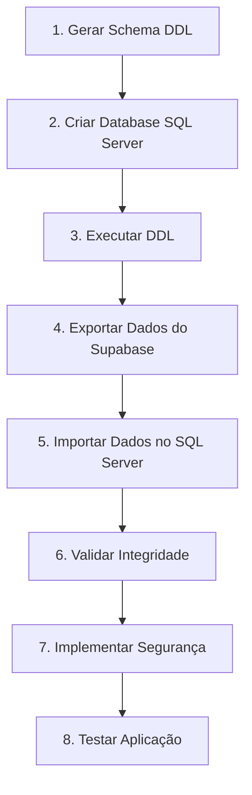

# Migração PostgreSQL → SQL Server

Este documento descreve o processo de migração do schema e dados do OKEAN CPQ de Supabase (PostgreSQL) para Microsoft SQL Server.

## Índice

1. [Visão Geral](#1-visão-geral)
2. [Scripts Disponíveis](#2-scripts-disponíveis)
3. [Geração do Schema (DDL)](#3-geração-do-schema-ddl)
4. [Exportação de Dados](#4-exportação-de-dados)
5. [Mapeamento de Tipos](#5-mapeamento-de-tipos)
6. [ENUMs e CHECK Constraints](#6-enums-e-check-constraints)
7. [Limitações e Soluções](#7-limitações-e-soluções)
8. [Processo de Migração Completo](#8-processo-de-migração-completo)
9. [Segurança no SQL Server](#9-segurança-no-sql-server)

---

## 1. Visão Geral

A migração do OKEAN CPQ do Supabase para SQL Server envolve duas etapas principais:

| Etapa | Script | Output |
|-------|--------|--------|
| **1. Schema (DDL)** | `generate-sqlserver-schema.js` | `okean-sqlserver-schema.sql` |
| **2. Dados** | `export-data-for-sqlserver.js` | CSVs + Scripts de importação |

### Tabelas Incluídas (37+ tabelas)

**Core:** `users`, `user_roles`, `clients`

**Modelos e Memorial:** `yacht_models`, `memorial_categories`, `memorial_items`, `memorial_upgrades`

**Opcionais e Configuração:** `options`, `job_stops`, `hull_numbers`

**Cotações:** `quotations`, `quotation_options`, `quotation_upgrades`, `quotation_customizations`

**Contratos:** `contracts`, `additional_to_orders`, `ato_configurations`

**Workflow:** `customization_workflow_steps`, `ato_workflow_steps`, `contract_delivery_checklist`

**Simulador:** `simulations`

**PDF:** `pdf_templates`, `pdf_template_versions`, `pdf_generated`

**Configuração:** `discount_limits_config`, `role_permissions_config`, `pm_yacht_model_assignments`

**Outros:** `audit_logs`, `mfa_recovery_codes`

---

## 2. Scripts Disponíveis

### 2.1 Geração de Schema (DDL)

```bash
# Script para gerar CREATE TABLE, Foreign Keys, Indexes
node scripts/generate-sqlserver-schema.js

# Output: output/okean-sqlserver-schema.sql
```

### 2.2 Exportação de Dados

```bash
# Configurar variáveis de ambiente
export SUPABASE_URL="https://qqxhkaowexieednyazwq.supabase.co"
export SUPABASE_SERVICE_ROLE_KEY="sua-service-role-key"

# Exportar apenas CSV (padrão)
node scripts/export-data-for-sqlserver.js

# Exportar apenas INSERT statements
node scripts/export-data-for-sqlserver.js --format=insert

# Exportar ambos (CSV + INSERT)
node scripts/export-data-for-sqlserver.js --format=both
```

### 2.3 Arquivos Gerados

| Arquivo | Descrição |
|---------|-----------|
| `output/okean-sqlserver-schema.sql` | DDL completo (CREATE TABLE, FKs, Indexes) |
| `output/data/*.csv` | Um arquivo CSV por tabela |
| `output/data/*-inserts.sql` | INSERT statements por tabela |
| `output/bulk-import-sqlserver.sql` | Script BULK INSERT pronto para SQL Server |
| `output/all-data-inserts.sql` | Todos os INSERTs em um único arquivo |

---

## 3. Geração do Schema (DDL)

### Pré-requisitos

```bash
# Node.js 18+ instalado
node --version

# Instalar dependências
npm install @supabase/supabase-js
```

### Execução

```bash
node scripts/generate-sqlserver-schema.js

# Resultado
# -> output/okean-sqlserver-schema.sql
```

### O que o Script Gera

1. **CREATE TABLE** para todas as tabelas
2. **Primary Keys** (UNIQUEIDENTIFIER com NEWID())
3. **CHECK Constraints** para ENUMs
4. **Valores Default** convertidos para T-SQL
5. **Foreign Keys** (ALTER TABLE separados)
6. **Indexes** recomendados

---

## 4. Exportação de Dados

### 4.1 Configuração

```bash
export SUPABASE_URL="https://qqxhkaowexieednyazwq.supabase.co"
export SUPABASE_SERVICE_ROLE_KEY="sua-service-role-key"
```

### 4.2 Formatos de Exportação

#### Opção 1: CSV (Recomendado para grandes volumes)

```bash
node scripts/export-data-for-sqlserver.js --format=csv
```

**Vantagens:**
- Melhor performance para grandes volumes
- Suporte a BULK INSERT nativo do SQL Server
- Arquivos menores

**Output:**
- `output/data/*.csv` - Um CSV por tabela
- `output/bulk-import-sqlserver.sql` - Script de importação

#### Opção 2: INSERT Statements

```bash
node scripts/export-data-for-sqlserver.js --format=insert
```

**Vantagens:**
- Portabilidade (funciona em qualquer SQL Server)
- Mais fácil de debugar
- Pode ser executado via SSMS

**Output:**
- `output/data/*-inserts.sql` - INSERTs por tabela
- `output/all-data-inserts.sql` - Arquivo único com todos os INSERTs

#### Opção 3: Ambos

```bash
node scripts/export-data-for-sqlserver.js --format=both
```

### 4.3 Conversão de Dados

O script converte automaticamente os tipos:

| Tipo PostgreSQL | Valor Original | Valor Exportado |
|-----------------|----------------|-----------------|
| `boolean` | `true` / `false` | `1` / `0` |
| `timestamp` | `2025-01-13T10:30:00Z` | `2025-01-13 10:30:00.000` |
| `jsonb` / `json` | `{"key": "value"}` | `'{"key": "value"}'` |
| `ARRAY` | `["a", "b"]` | `'["a", "b"]'` |
| `NULL` | `null` | `NULL` ou campo vazio |

### 4.4 Importando no SQL Server

#### Via BULK INSERT (CSV)

```sql
-- 1. Executar o schema DDL primeiro
-- 2. Copiar CSVs para o servidor SQL Server
-- 3. Editar paths no bulk-import-sqlserver.sql
-- 4. Executar o script

sqlcmd -S servidor -d OkeanCPQ -i bulk-import-sqlserver.sql
```

#### Via INSERT Statements

```sql
-- Executar o arquivo combinado
sqlcmd -S servidor -d OkeanCPQ -i all-data-inserts.sql
```

---

## 5. Mapeamento de Tipos

### Tipos Básicos

| PostgreSQL | SQL Server | Notas |
|------------|------------|-------|
| `uuid` | `UNIQUEIDENTIFIER` | |
| `text` | `NVARCHAR(MAX)` | |
| `character varying(n)` | `NVARCHAR(n)` | |
| `boolean` | `BIT` | 1=true, 0=false |
| `integer` | `INT` | |
| `bigint` | `BIGINT` | |
| `numeric` | `DECIMAL(18,2)` | |

### Tipos de Data/Hora

| PostgreSQL | SQL Server |
|------------|------------|
| `timestamp with time zone` | `DATETIMEOFFSET` |
| `timestamp without time zone` | `DATETIME2` |
| `date` | `DATE` |

### Tipos Especiais

| PostgreSQL | SQL Server | Notas |
|------------|------------|-------|
| `jsonb` / `json` | `NVARCHAR(MAX)` | Usar JSON_VALUE() para consultas |
| `inet` | `VARCHAR(45)` | IPv4/IPv6 |
| `ARRAY` | `NVARCHAR(MAX)` | Armazenar como JSON |
| `USER-DEFINED` (enum) | `VARCHAR(n)` + CHECK | |

### Conversão de Defaults

| PostgreSQL | SQL Server |
|------------|------------|
| `gen_random_uuid()` | `NEWID()` |
| `now()` | `SYSDATETIMEOFFSET()` |
| `true` / `false` | `1` / `0` |
| `'{}'` (array vazio) | `'[]'` |

---

## 6. ENUMs e CHECK Constraints

### Problema

PostgreSQL suporta ENUMs nativos. SQL Server não.

### Solução: CHECK Constraints

```sql
-- PostgreSQL
CREATE TYPE app_role AS ENUM ('administrador', 'gerente_comercial', ...);

-- SQL Server
CREATE TABLE user_roles (
  role VARCHAR(50) NOT NULL,
  CONSTRAINT CK_user_roles_role CHECK (role IN (
    'administrador', 'gerente_comercial', 'comercial', 'producao',
    'financeiro', 'pm_engenharia', 'comprador', 'planejador',
    'broker', 'diretor_comercial', 'backoffice_comercial'
  ))
);
```

### ENUMs do Sistema

| Nome | Valores |
|------|---------|
| `app_role` | administrador, gerente_comercial, comercial, producao, financeiro, pm_engenharia, comprador, planejador, broker, diretor_comercial, backoffice_comercial |
| `approval_status` | pending, approved, rejected |
| `approval_type` | commercial, technical, engineering |
| `memorial_category` | deck_principal, conves_principal, plataforma_popa, salao, ... (41 valores) |
| `pdf_document_type` | quotation, contract, ato, simulation, contract_summary, original_contract |
| `pdf_template_status` | draft, published, archived |

---

## 7. Limitações e Soluções

### 7.1 Row Level Security (RLS)

**PostgreSQL:** Suporte nativo a RLS.

**SQL Server (2016+):** Usar Security Predicates:

```sql
CREATE FUNCTION dbo.fn_securitypredicate(@user_id UNIQUEIDENTIFIER)
RETURNS TABLE
WITH SCHEMABINDING
AS
RETURN SELECT 1 AS result
WHERE @user_id = CAST(SESSION_CONTEXT(N'user_id') AS UNIQUEIDENTIFIER)
OR IS_MEMBER('db_admin') = 1;
GO

CREATE SECURITY POLICY QuotationsPolicy
ADD FILTER PREDICATE dbo.fn_securitypredicate(created_by)
ON dbo.quotations;
```

### 7.2 JSONB Operators

**PostgreSQL:**
```sql
SELECT data->>'name' FROM table;
SELECT * FROM table WHERE data @> '{"key": "value"}';
```

**SQL Server:**
```sql
SELECT JSON_VALUE(data, '$.name') FROM table;
SELECT * FROM table WHERE JSON_VALUE(data, '$.key') = 'value';
```

### 7.3 Arrays

**PostgreSQL:**
```sql
SELECT * FROM table WHERE 'value' = ANY(array_column);
```

**SQL Server:**
```sql
SELECT * FROM table
CROSS APPLY OPENJSON(json_array_column) AS items
WHERE items.value = 'value';
```

### 7.4 Functions e Triggers

Triggers precisam ser reescritos de PL/pgSQL para T-SQL:

```sql
-- PostgreSQL
CREATE OR REPLACE FUNCTION set_updated_at()
RETURNS trigger AS $$
BEGIN
  NEW.updated_at = now();
  RETURN NEW;
END;
$$ LANGUAGE plpgsql;

-- SQL Server
CREATE TRIGGER tr_set_updated_at
ON dbo.quotations
AFTER UPDATE
AS
BEGIN
  UPDATE q
  SET updated_at = SYSDATETIMEOFFSET()
  FROM dbo.quotations q
  INNER JOIN inserted i ON q.id = i.id;
END;
```

---

## 8. Processo de Migração Completo

### Checklist

```
1. PREPARAÇÃO
   [ ] Instalar Node.js 18+
   [ ] Configurar variáveis de ambiente
   [ ] Criar database OkeanCPQ no SQL Server

2. SCHEMA
   [ ] Executar: node scripts/generate-sqlserver-schema.js
   [ ] Revisar DDL gerado
   [ ] Executar DDL no SQL Server

3. DADOS
   [ ] Executar: node scripts/export-data-for-sqlserver.js --format=both
   [ ] Copiar CSVs para servidor SQL Server
   [ ] Editar paths no bulk-import-sqlserver.sql
   [ ] Executar importação

4. VALIDAÇÃO
   [ ] Verificar contagens de registros
   [ ] Testar queries principais
   [ ] Validar integridade referencial

5. SEGURANÇA
   [ ] Implementar Security Policies
   [ ] Criar roles de database
   [ ] Configurar auditoria

6. APLICAÇÃO
   [ ] Atualizar connection string
   [ ] Ajustar queries com JSON/Array
   [ ] Testar funcionalidades
```

### Diagrama de Processo



---

## 9. Segurança no SQL Server

### 9.1 Autenticação

Opções disponíveis:
1. **Azure AD Integration** (recomendado para Azure SQL)
2. **SQL Server Authentication**
3. **Windows Authentication** (on-premises)

### 9.2 Autorização

**Database Roles:**
```sql
CREATE ROLE app_vendedor;
GRANT SELECT, INSERT, UPDATE ON quotations TO app_vendedor;
```

**Stored Procedures:**
```sql
CREATE PROCEDURE sp_GetUserQuotations
  @user_id UNIQUEIDENTIFIER
AS
BEGIN
  SELECT * FROM quotations
  WHERE created_by = @user_id
  OR EXISTS (
    SELECT 1 FROM user_roles
    WHERE user_id = @user_id
    AND role IN ('administrador', 'gerente_comercial')
  );
END;
```

### 9.3 Auditoria

```sql
CREATE TRIGGER tr_audit_quotations
ON dbo.quotations
AFTER INSERT, UPDATE, DELETE
AS
BEGIN
  INSERT INTO audit_logs (
    user_id, action, table_name, record_id,
    old_values, new_values, created_at
  )
  SELECT
    CAST(SESSION_CONTEXT(N'user_id') AS UNIQUEIDENTIFIER),
    CASE
      WHEN EXISTS(SELECT 1 FROM inserted) AND EXISTS(SELECT 1 FROM deleted) THEN 'UPDATE'
      WHEN EXISTS(SELECT 1 FROM inserted) THEN 'INSERT'
      ELSE 'DELETE'
    END,
    'quotations',
    COALESCE(i.id, d.id),
    (SELECT d.* FOR JSON PATH, WITHOUT_ARRAY_WRAPPER),
    (SELECT i.* FOR JSON PATH, WITHOUT_ARRAY_WRAPPER),
    SYSDATETIMEOFFSET()
  FROM inserted i
  FULL OUTER JOIN deleted d ON i.id = d.id;
END;
```

---

## Suporte

Para dúvidas sobre a migração, consulte:
- [Documentação SQL Server](https://docs.microsoft.com/sql/sql-server/)
- [Azure SQL Database](https://docs.microsoft.com/azure/azure-sql/)
- [JSON no SQL Server](https://docs.microsoft.com/sql/relational-databases/json/json-data-sql-server)
- [SSMA para PostgreSQL](https://docs.microsoft.com/sql/ssma/postgresql/)
