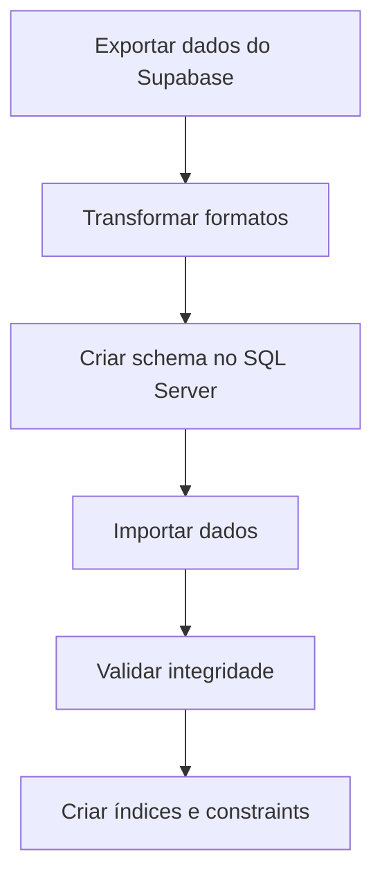

# Guia de Migração PostgreSQL → SQL Server

Este documento descreve o processo de migração do schema do OKEAN CPQ de Supabase (PostgreSQL) para Microsoft SQL Server.

## Índice

1. [Visão Geral](#1-visão-geral)
2. [Executando o Script](#2-executando-o-script)
3. [Mapeamento de Tipos](#3-mapeamento-de-tipos)
4. [ENUMs](#4-enums)
5. [Limitações](#5-limitações)
6. [Adaptações Necessárias](#6-adaptações-necessárias)
7. [Migração de Dados](#7-migração-de-dados)
8. [Segurança](#8-segurança)

---

## 1. Visão Geral

### Arquivos Gerados

| Arquivo | Descrição |
|---------|-----------|
| `scripts/generate-sqlserver-schema.js` | Script Node.js para gerar DDL |
| `output/okean-sqlserver-schema.sql` | Schema SQL Server gerado |

### Tabelas Incluídas (37 tabelas)

**Core:**
- `users`, `user_roles`, `clients`

**Modelos e Memorial:**
- `yacht_models`, `memorial_categories`, `memorial_items`, `memorial_upgrades`

**Opcionais e Configuração:**
- `options`, `job_stops`, `hull_numbers`

**Cotações:**
- `quotations`, `quotation_options`, `quotation_upgrades`, `quotation_customizations`

**Contratos:**
- `contracts`, `additional_to_orders`, `ato_configurations`

**Workflow:**
- `customization_workflow_steps`, `ato_workflow_steps`, `contract_delivery_checklist`

**Simulador:**
- `simulations`, `simulator_exchange_rates`, `simulator_commissions`, `simulator_model_costs`, `simulator_business_rules`

**PDF:**
- `pdf_templates`, `pdf_template_versions`, `pdf_generated`

**Configuração:**
- `discount_limits_config`, `role_permissions_config`, `pm_yacht_model_assignments`
- `system_config`, `workflow_config`, `workflow_settings`

**Outros:**
- `audit_logs`, `mfa_recovery_codes`

---

## 2. Executando o Script

### Pré-requisitos

```bash
# Node.js 18+ instalado
node --version

# Instalar dependências
npm install @supabase/supabase-js
```

### Configuração

```bash
# Configurar variáveis de ambiente
export SUPABASE_URL="https://qqxhkaowexieednyazwq.supabase.co"
export SUPABASE_SERVICE_ROLE_KEY="sua-service-role-key"
```

### Execução

```bash
# Executar script
node scripts/generate-sqlserver-schema.js

# Resultado
# -> output/okean-sqlserver-schema.sql
```

---

## 3. Mapeamento de Tipos

### Tipos Básicos

| PostgreSQL | SQL Server | Notas |
|------------|------------|-------|
| `uuid` | `UNIQUEIDENTIFIER` | |
| `text` | `NVARCHAR(MAX)` | |
| `character varying(n)` | `NVARCHAR(n)` | |
| `boolean` | `BIT` | 1=true, 0=false |
| `integer` | `INT` | |
| `bigint` | `BIGINT` | |
| `smallint` | `SMALLINT` | |
| `numeric` | `DECIMAL(18,2)` | Ajuste precisão conforme necessário |
| `real` | `REAL` | |
| `double precision` | `FLOAT` | |

### Tipos de Data/Hora

| PostgreSQL | SQL Server | Notas |
|------------|------------|-------|
| `timestamp with time zone` | `DATETIMEOFFSET` | Preserva timezone |
| `timestamp without time zone` | `DATETIME2` | |
| `date` | `DATE` | |
| `time` | `TIME` | |

### Tipos Especiais

| PostgreSQL | SQL Server | Notas |
|------------|------------|-------|
| `jsonb` / `json` | `NVARCHAR(MAX)` | JSON nativo SQL Server 2016+ |
| `inet` | `VARCHAR(45)` | IPv4/IPv6 |
| `bytea` | `VARBINARY(MAX)` | |
| `ARRAY` | `NVARCHAR(MAX)` | Armazenar como JSON |
| `USER-DEFINED` (enum) | `VARCHAR(n)` + CHECK | |

### Conversão de Defaults

| PostgreSQL | SQL Server |
|------------|------------|
| `gen_random_uuid()` | `NEWID()` |
| `uuid_generate_v4()` | `NEWID()` |
| `now()` | `GETDATE()` ou `SYSDATETIMEOFFSET()` |
| `CURRENT_TIMESTAMP` | `SYSDATETIMEOFFSET()` |
| `true` | `1` |
| `false` | `0` |
| `'{}'` (array) | `'[]'` (JSON) |

---

## 4. ENUMs

### Problema

PostgreSQL suporta ENUMs nativos. SQL Server não.

### Solução: CHECK Constraints

```sql
-- PostgreSQL
CREATE TYPE app_role AS ENUM ('administrador', 'gerente_comercial', ...);

-- SQL Server
CREATE TABLE user_roles (
  role VARCHAR(50) NOT NULL,
  CONSTRAINT CK_user_roles_role CHECK (role IN (
    'administrador', 'gerente_comercial', 'comercial', 'producao',
    'financeiro', 'pm_engenharia', 'comprador', 'planejador',
    'broker', 'diretor_comercial', 'backoffice_comercial'
  ))
);
```

### ENUMs do Sistema

| Nome | Valores |
|------|---------|
| `app_role` | administrador, gerente_comercial, comercial, producao, financeiro, pm_engenharia, comprador, planejador, broker, diretor_comercial, backoffice_comercial |
| `approval_status` | pending, approved, rejected |
| `approval_type` | commercial, technical, engineering |
| `memorial_category` | deck_principal, conves_principal, plataforma_popa, salao, ... (41 valores) |
| `pdf_document_type` | quotation, contract, ato, simulation, contract_summary, original_contract |
| `pdf_template_status` | draft, published, archived |

---

## 5. Limitações

### Row Level Security (RLS)

**PostgreSQL:** Suporte nativo a RLS com políticas por tabela.

**SQL Server:** Não existe RLS nativo da mesma forma.

**Alternativas:**
1. **Views com segurança:** Criar views que filtram dados por usuário
2. **Stored Procedures:** Encapsular acesso via procedures
3. **Row-Level Security (SQL Server 2016+):** Usar Security Predicates

```sql
-- Exemplo: Security Policy no SQL Server 2016+
CREATE FUNCTION dbo.fn_securitypredicate(@user_id UNIQUEIDENTIFIER)
RETURNS TABLE
WITH SCHEMABINDING
AS
RETURN SELECT 1 AS result
WHERE @user_id = CAST(SESSION_CONTEXT(N'user_id') AS UNIQUEIDENTIFIER)
OR IS_MEMBER('db_admin') = 1;
GO

CREATE SECURITY POLICY QuotationsPolicy
ADD FILTER PREDICATE dbo.fn_securitypredicate(created_by)
ON dbo.quotations;
```

### JSONB Operators

**PostgreSQL:**
```sql
-- Extrair valor
SELECT data->>'name' FROM table;

-- Busca em JSON
SELECT * FROM table WHERE data @> '{"key": "value"}';
```

**SQL Server:**
```sql
-- Extrair valor
SELECT JSON_VALUE(data, '$.name') FROM table;

-- Busca em JSON
SELECT * FROM table WHERE JSON_VALUE(data, '$.key') = 'value';

-- Consultar array JSON
SELECT * FROM table
CROSS APPLY OPENJSON(data, '$.items') AS items;
```

### Arrays

**PostgreSQL:**
```sql
-- Array nativo
SELECT * FROM table WHERE 'value' = ANY(array_column);
```

**SQL Server:**
```sql
-- Armazenar como JSON e usar OPENJSON
SELECT * FROM table
CROSS APPLY OPENJSON(json_array_column) AS items
WHERE items.value = 'value';
```

### Functions e Triggers

| Item | PostgreSQL | SQL Server |
|------|------------|------------|
| Linguagem | PL/pgSQL | T-SQL |
| Funções | `CREATE FUNCTION` | `CREATE FUNCTION` ou `CREATE PROCEDURE` |
| Triggers | `BEFORE/AFTER INSERT/UPDATE/DELETE` | `INSTEAD OF` ou `AFTER INSERT/UPDATE/DELETE` |
| Return | `RETURNS TABLE` | `RETURNS TABLE` ou `OUTPUT` parameters |

**Exemplo de conversão:**

```sql
-- PostgreSQL
CREATE OR REPLACE FUNCTION set_updated_at()
RETURNS trigger AS $$
BEGIN
  NEW.updated_at = now();
  RETURN NEW;
END;
$$ LANGUAGE plpgsql;

-- SQL Server
CREATE TRIGGER tr_set_updated_at
ON dbo.quotations
AFTER UPDATE
AS
BEGIN
  UPDATE q
  SET updated_at = SYSDATETIMEOFFSET()
  FROM dbo.quotations q
  INNER JOIN inserted i ON q.id = i.id;
END;
```

---

## 6. Adaptações Necessárias

### 6.1 Queries com JSON

**Antes (PostgreSQL):**
```typescript
const { data } = await supabase
  .from('memorial_items')
  .select('*')
  .contains('technical_specs', { type: 'motor' });
```

**Depois (SQL Server via API):**
```sql
SELECT * FROM memorial_items
WHERE JSON_VALUE(technical_specs, '$.type') = 'motor';
```

### 6.2 Queries com Arrays

**Antes (PostgreSQL):**
```typescript
const { data } = await supabase
  .from('quotation_customizations')
  .select('*')
  .overlaps('file_paths', ['path1', 'path2']);
```

**Depois (SQL Server):**
```sql
SELECT * FROM quotation_customizations
WHERE EXISTS (
  SELECT 1 FROM OPENJSON(file_paths) fp
  WHERE fp.value IN ('path1', 'path2')
);
```

### 6.3 UUID Generation

**PostgreSQL:** `gen_random_uuid()`

**SQL Server:** `NEWID()`

No código da aplicação, gerar UUIDs via biblioteca ao invés de depender do banco:

```typescript
import { v4 as uuidv4 } from 'uuid';
const id = uuidv4();
```

---

## 7. Migração de Dados

### 7.1 Ferramentas Recomendadas

1. **Azure Data Studio** - Free, multiplataforma
2. **SQL Server Migration Assistant (SSMA)** - Ferramenta oficial Microsoft
3. **Azure Data Factory** - Para pipelines de ETL
4. **BCP (Bulk Copy Program)** - Para grandes volumes

### 7.2 Processo Sugerido



### 7.3 Exportar do Supabase

```bash
# Via pg_dump
pg_dump -h db.qqxhkaowexieednyazwq.supabase.co \
  -U postgres \
  -d postgres \
  --data-only \
  --format=csv \
  --table=public.quotations \
  > quotations.csv
```

### 7.4 Importar no SQL Server

```sql
-- Via BULK INSERT
BULK INSERT dbo.quotations
FROM 'C:\data\quotations.csv'
WITH (
    FORMAT = 'CSV',
    FIRSTROW = 2,
    FIELDTERMINATOR = ',',
    ROWTERMINATOR = '\n',
    CODEPAGE = '65001' -- UTF-8
);
```

---

## 8. Segurança

### 8.1 Autenticação

O Supabase usa JWT com auth.users. No SQL Server, você precisará:

1. **Azure AD Integration** (recomendado para Azure SQL)
2. **SQL Server Authentication**
3. **Windows Authentication** (on-premises)

### 8.2 Autorização

**Implementar via:**

1. **Database Roles:**
```sql
CREATE ROLE app_vendedor;
GRANT SELECT ON quotations TO app_vendedor;
GRANT INSERT ON quotations TO app_vendedor;
```

2. **Stored Procedures:**
```sql
CREATE PROCEDURE sp_GetUserQuotations
  @user_id UNIQUEIDENTIFIER
AS
BEGIN
  SELECT * FROM quotations
  WHERE created_by = @user_id
  OR EXISTS (
    SELECT 1 FROM user_roles
    WHERE user_id = @user_id
    AND role IN ('administrador', 'gerente_comercial')
  );
END;
```

3. **Application-Level Security:**
```typescript
// Validar role antes de executar query
if (!user.hasRole('administrador')) {
  query = query.where('created_by', user.id);
}
```

### 8.3 Auditoria

A tabela `audit_logs` será migrada. Para manter funcionalidade similar:

```sql
-- Trigger de auditoria genérico
CREATE TRIGGER tr_audit_quotations
ON dbo.quotations
AFTER INSERT, UPDATE, DELETE
AS
BEGIN
  -- Inserir log de auditoria
  INSERT INTO audit_logs (
    user_id, action, table_name, record_id,
    old_values, new_values, created_at
  )
  SELECT
    CAST(SESSION_CONTEXT(N'user_id') AS UNIQUEIDENTIFIER),
    CASE
      WHEN EXISTS(SELECT 1 FROM inserted) AND EXISTS(SELECT 1 FROM deleted) THEN 'UPDATE'
      WHEN EXISTS(SELECT 1 FROM inserted) THEN 'INSERT'
      ELSE 'DELETE'
    END,
    'quotations',
    COALESCE(i.id, d.id),
    (SELECT d.* FOR JSON PATH, WITHOUT_ARRAY_WRAPPER),
    (SELECT i.* FOR JSON PATH, WITHOUT_ARRAY_WRAPPER),
    SYSDATETIMEOFFSET()
  FROM inserted i
  FULL OUTER JOIN deleted d ON i.id = d.id;
END;
```

---

## Checklist de Migração

- [ ] Executar script de geração do schema
- [ ] Revisar DDL gerado
- [ ] Criar database no SQL Server
- [ ] Executar DDL (tabelas sem FKs primeiro)
- [ ] Adicionar Foreign Keys
- [ ] Criar índices
- [ ] Exportar dados do Supabase
- [ ] Transformar dados (especialmente JSON/Arrays)
- [ ] Importar dados
- [ ] Validar contagens de registros
- [ ] Reescrever triggers em T-SQL
- [ ] Implementar segurança (roles, procedures)
- [ ] Testar aplicação com novo backend
- [ ] Ajustar queries com JSON/Array

---

## Suporte

Para dúvidas sobre a migração, consulte:
- [Documentação SQL Server](https://docs.microsoft.com/sql/sql-server/)
- [Azure SQL Database](https://docs.microsoft.com/azure/azure-sql/)
- [SSMA para PostgreSQL](https://docs.microsoft.com/sql/ssma/postgresql/)
