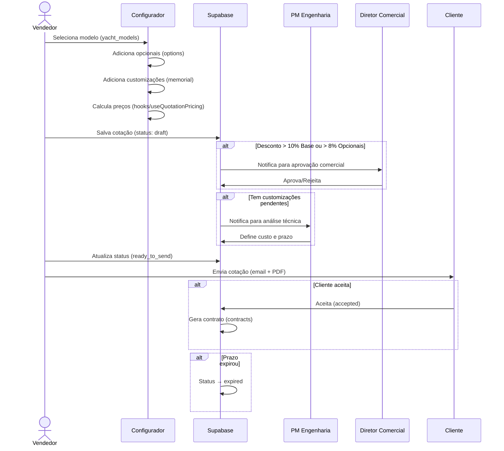
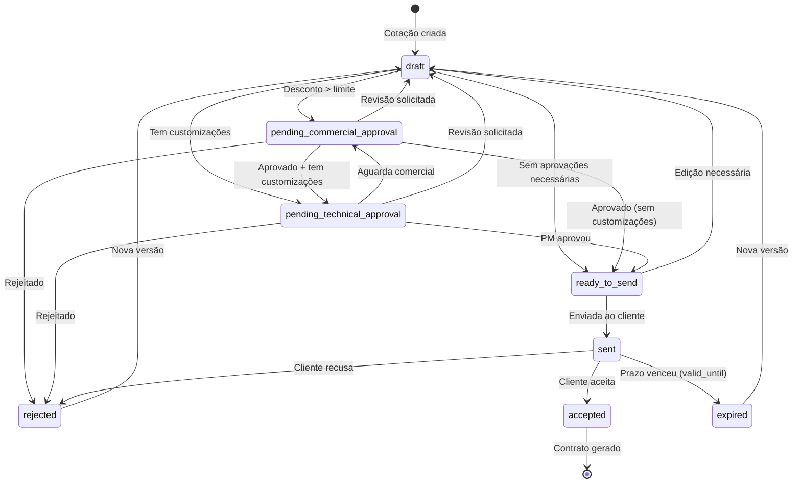
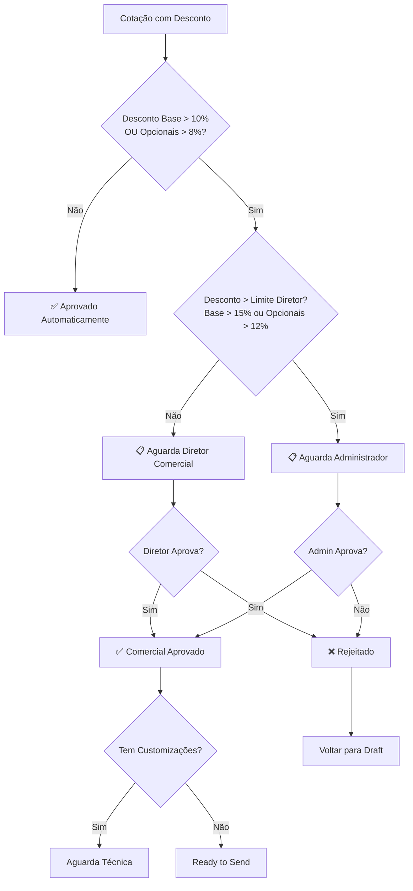
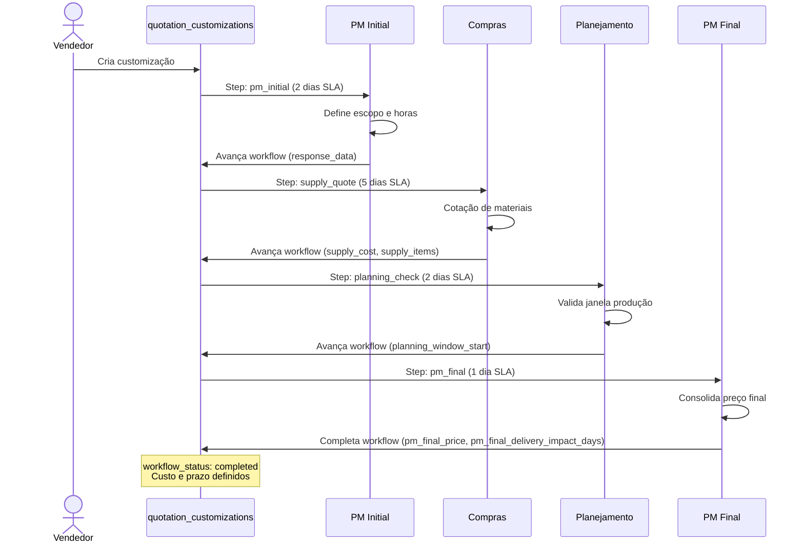
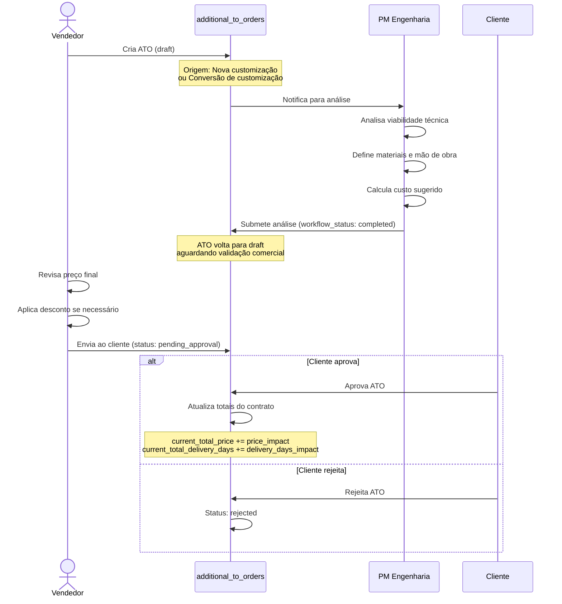
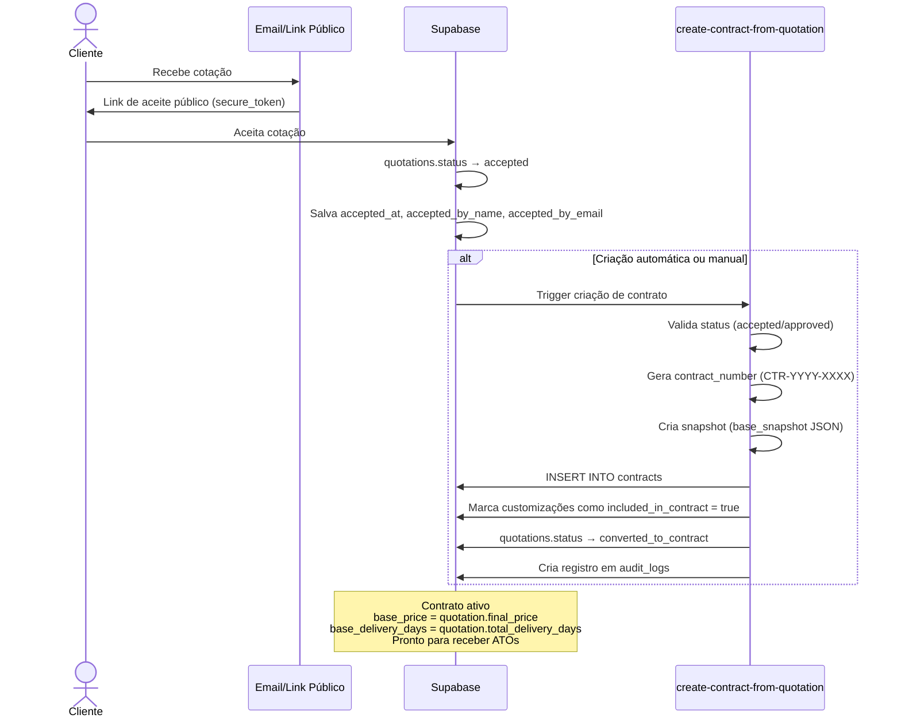
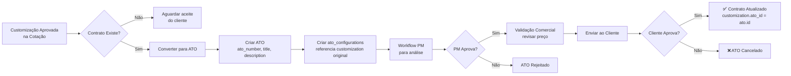

# 🔄 Workflows do Sistema - OKEAN Yachts CPQ

Este documento detalha os principais fluxos de negócio do sistema CPQ usando diagramas Mermaid.

## Índice

1. [Workflow de Cotação Completo](#1-workflow-de-cotação-completo)
2. [Estados de Cotação](#2-estados-de-cotação)
3. [Workflow de Limites de Desconto](#3-workflow-de-limites-de-desconto)
4. [Workflow de Customizações - Simplificado](#4-workflow-de-customizações---simplificado)
5. [Workflow de Customizações - Completo (Legacy)](#5-workflow-de-customizações---completo-legacy)
6. [Workflow de ATOs](#6-workflow-de-atos-aditivos-de-contrato)
7. [Estados de ATO](#7-estados-de-ato)
8. [Criação de Contrato](#8-criação-de-contrato)
9. [Conversão Customização → ATO](#9-conversão-customização--ato)
10. [Referência de Status](#10-referência-de-status)

---

## Legenda de Atores

| Ator | Descrição |
|------|-----------|
| **Vendedor** | Usuário com role `comercial` ou `gerente_comercial` |
| **PM Engenharia** | Usuário com role `pm_engenharia` |
| **Diretor Comercial** | Usuário com role `diretor_comercial` |
| **Administrador** | Usuário com role `administrador` |
| **Cliente** | Cliente externo (acesso via link público) |

---

## 1. Workflow de Cotação Completo

Fluxo completo desde a criação até a conversão em contrato.



**Arquivos envolvidos:**
- `src/pages/Configurator.tsx` - Interface do configurador
- `src/hooks/quotations/useQuotationPricing.ts` - Cálculo de preços
- `src/hooks/useSaveQuotation.ts` - Salvamento de cotações
- `src/hooks/useSendQuotation.ts` - Envio ao cliente
- `supabase/functions/send-quotation-email/` - Envio de email

---

## 2. Estados de Cotação

Máquina de estados completa de uma cotação.



**Lógica implementada em:**
- `src/lib/quotation-status-utils.ts` - Função `calculateQuotationStatus()`
- `src/hooks/useQuotationStatus.ts` - Hook para calcular status

---

## 3. Workflow de Limites de Desconto

Determina qual nível de aprovação é necessário baseado no desconto aplicado.



**Configuração de limites:**
- Tabela: `discount_limits_config`
- Limites editáveis em: `/admin/discount-settings`

**Arquivos envolvidos:**
- `src/lib/approval-utils.ts` - Funções `getRequiredApproverRole()`, `needsApproval()`
- `src/hooks/useDiscountLimits.ts` - Gerenciamento de limites
- `src/pages/AdminDiscountSettings.tsx` - Interface de configuração

---

## 4. Workflow de Customizações - Simplificado

Sistema simplificado de aprovação de customizações (flag: `use_simplified_workflow`).

```mermaid
stateDiagram-v2
    [*] --> pending: Customização criada

    pending --> pending_pm_review: Cotação submetida

    pending_pm_review --> approved: PM aprova (define custo/prazo)
    pending_pm_review --> rejected: PM rejeita

    approved --> [*]: Incluída no cálculo final
    rejected --> [*]: Removida ou revisada

    note right of pending_pm_review: PM define:\n- Custo adicional\n- Impacto no prazo\n- Notas técnicas
```

**Quando usar:**
- Flag ativa: `workflow_config.use_simplified_workflow = true`
- Aprovação única pelo PM Engenharia
- SLA: 2-3 dias

**Arquivos envolvidos:**
- `src/hooks/useSimplifiedWorkflow.ts` - Verifica flag
- `src/components/approvals/SimplifiedTechnicalApprovalDialog.tsx` - Interface de aprovação
- `src/pages/Approvals.tsx` - Página de aprovações

**Documentação:** [WORKFLOW_SIMPLIFICADO.md](./WORKFLOW_SIMPLIFICADO.md)

---

## 5. Workflow de Customizações - Completo (Legacy)

Sistema completo de 4 etapas (usado quando `use_simplified_workflow = false`).



**Etapas do workflow:**
1. `pm_initial` - PM define escopo e horas de engenharia
2. `supply_quote` - Compras cotam materiais
3. `planning_check` - Planejamento valida janela de produção
4. `pm_final` - PM consolida custos e prazos finais

**Arquivos envolvidos:**
- `src/hooks/useCustomizationWorkflow.ts` - Gerencia workflow completo
- `src/components/configurator/workflow/` - Componentes de cada etapa
- `supabase/functions/advance-customization-workflow/` - Edge function de avanço

---

## 6. Workflow de ATOs (Aditivos de Contrato)

Fluxo de criação e aprovação de aditivos após contrato assinado.



**Tabelas envolvidas:**
- `additional_to_orders` - Dados do ATO
- `ato_configurations` - Items configurados no ATO
- `ato_workflow_steps` - Histórico de aprovações

**Arquivos envolvidos:**
- `src/hooks/useATOs.ts` - CRUD de ATOs
- `src/hooks/useATOWorkflow.ts` - Gerencia workflow
- `src/hooks/useSendATO.ts` - Envio ao cliente
- `supabase/functions/advance-ato-workflow/` - Edge function de avanço

---

## 7. Estados de ATO

Máquina de estados de um aditivo de contrato.

```mermaid
stateDiagram-v2
    [*] --> draft: ATO criado

    draft --> pm_review: Enviado para análise PM
    
    pm_review --> draft: PM completa análise (workflow_status: completed)
    pm_review --> rejected: PM rejeita

    draft --> pending_approval: Vendedor envia ao cliente
    
    pending_approval --> approved: Cliente aprova
    pending_approval --> rejected: Cliente rejeita
    
    approved --> [*]: Contrato atualizado
    rejected --> draft: Pode ser revisado
    rejected --> cancelled: Cancelado definitivamente

    note right of approved: Atualiza:\n- current_total_price\n- current_total_delivery_days\n- no contrato pai
```

**Status possíveis:**
- `draft` - Em edição ou aguardando análise PM
- `pending_approval` - Aguardando aprovação do cliente
- `approved` - Aprovado e aplicado ao contrato
- `rejected` - Rejeitado pelo cliente
- `cancelled` - Cancelado definitivamente

---

## 8. Criação de Contrato

Processo de conversão de cotação aceita em contrato.



**Dados copiados para contrato:**
- `base_price` - Preço final da cotação (com descontos)
- `base_delivery_days` - Prazo total da cotação
- `base_snapshot` - JSON completo da cotação (memorial, opcionais, customizações)
- `current_total_price` - Inicialmente igual a base_price
- `current_total_delivery_days` - Inicialmente igual a base_delivery_days

**Arquivos envolvidos:**
- `supabase/functions/create-contract-from-quotation/` - Lógica de criação
- `src/hooks/useContracts.ts` - Gerenciamento de contratos

---

## 9. Conversão Customização → ATO

Fluxo de conversão de uma customização aprovada na cotação para um ATO no contrato.



**Quando usar:**
- Cliente solicita mudança após contrato assinado
- Customização não foi incluída no contrato original
- Necessidade de adicionar opcionais

**Arquivos envolvidos:**
- `src/hooks/useConvertCustomizationToATO.ts` - Lógica de conversão
- `src/components/contracts/ConvertCustomizationDialog.tsx` - Interface
- `supabase/functions/convert-customization-to-ato/` - Edge function

---

## 10. Referência de Status

### Cotações (quotations.status)

| Status | Descrição | Próximos Estados Válidos |
|--------|-----------|--------------------------|
| `draft` | Rascunho em edição | `pending_commercial_approval`, `pending_technical_approval`, `ready_to_send` |
| `pending_commercial_approval` | Aguardando aprovação de desconto | `ready_to_send`, `pending_technical_approval`, `rejected`, `draft` |
| `pending_technical_approval` | Aguardando análise técnica de customizações | `ready_to_send`, `pending_commercial_approval`, `rejected`, `draft` |
| `ready_to_send` | Aprovada e pronta para envio | `sent`, `draft` |
| `sent` | Enviada ao cliente (aguardando resposta) | `accepted`, `rejected`, `expired` |
| `accepted` | Cliente aceitou | `converted_to_contract` (após criação do contrato) |
| `expired` | Prazo de validade venceu (valid_until) | `draft` (nova versão) |
| `rejected` | Rejeitada (por aprovador ou cliente) | `draft` (nova versão) |

### ATOs (additional_to_orders.status)

| Status | Descrição | Próximos Estados Válidos |
|--------|-----------|--------------------------|
| `draft` | Em edição ou aguardando análise PM | `pending_approval`, `rejected` |
| `pending_approval` | Aguardando aprovação do cliente | `approved`, `rejected` |
| `approved` | Cliente aprovou e contrato foi atualizado | - (estado final) |
| `rejected` | Rejeitado pelo cliente ou PM | `draft`, `cancelled` |
| `cancelled` | Cancelado definitivamente | - (estado final) |

### Workflow Status (customizations & ATOs)

| workflow_status | Descrição |
|-----------------|-----------|
| `pending` | Aguardando início do workflow |
| `pm_review` | Em análise pelo PM |
| `supply_quote` | Compras cotando materiais (workflow completo) |
| `planning_check` | Planejamento validando janela (workflow completo) |
| `pm_final` | PM finalizando custos (workflow completo) |
| `completed` | Workflow concluído |
| `rejected` | Rejeitado em alguma etapa |

---

## Links Relacionados

- **[ARCHITECTURE.md](./ARCHITECTURE.md)** - Arquitetura geral do sistema
- **[DATABASE.md](./DATABASE.md)** - Schema completo do banco de dados
- **[WORKFLOW_SIMPLIFICADO.md](./WORKFLOW_SIMPLIFICADO.md)** - Detalhes do workflow simplificado
- **[GETTING_STARTED.md](./GETTING_STARTED.md)** - Guia para novos desenvolvedores
- **[CONTRIBUTING.md](../CONTRIBUTING.md)** - Guia completo de contribuição

---

## Notas Técnicas

### Configuração de Limites de Desconto

Os limites são editáveis dinamicamente em `/admin/discount-settings` e armazenados em `discount_limits_config`:

```sql
SELECT * FROM discount_limits_config;

-- Exemplo de resultado:
-- limit_type: 'base'
-- no_approval_max: 10
-- director_approval_max: 15
-- admin_approval_required_above: 15

-- limit_type: 'options'
-- no_approval_max: 8
-- director_approval_max: 12
-- admin_approval_required_above: 12
```

### Feature Toggle: Workflow Simplificado

Para ativar/desativar o workflow simplificado de customizações:

```sql
-- Ativar
UPDATE workflow_config 
SET config_value = '{"enabled": true}'::jsonb
WHERE config_key = 'use_simplified_workflow';

-- Desativar
UPDATE workflow_config 
SET config_value = '{"enabled": false}'::jsonb
WHERE config_key = 'use_simplified_workflow';

-- Verificar status
SELECT config_key, config_value 
FROM workflow_config 
WHERE config_key = 'use_simplified_workflow';
```

### Cálculo de Status de Cotação

O status de uma cotação é calculado dinamicamente pela função `calculateQuotationStatus()` em `src/lib/quotation-status-utils.ts`:

```typescript
const status = calculateQuotationStatus({
  hasDiscounts: baseDiscountPercentage > 0 || optionsDiscountPercentage > 0,
  baseDiscount: baseDiscountPercentage,
  optionsDiscount: optionsDiscountPercentage,
  hasCustomizations: customizations.length > 0,
  commercialApproved: commercialApprovalStatus === 'approved',
  technicalApproved: engineeringApprovalStatus === 'approved',
  isExpired: isAfter(new Date(), new Date(validUntil)),
  currentStatus: quotation.status
});
```

---

**Versão:** 1.0.0  
**Última atualização:** 2025-01-27  
**Mantenedor:** Equipe OKEAN Yachts
